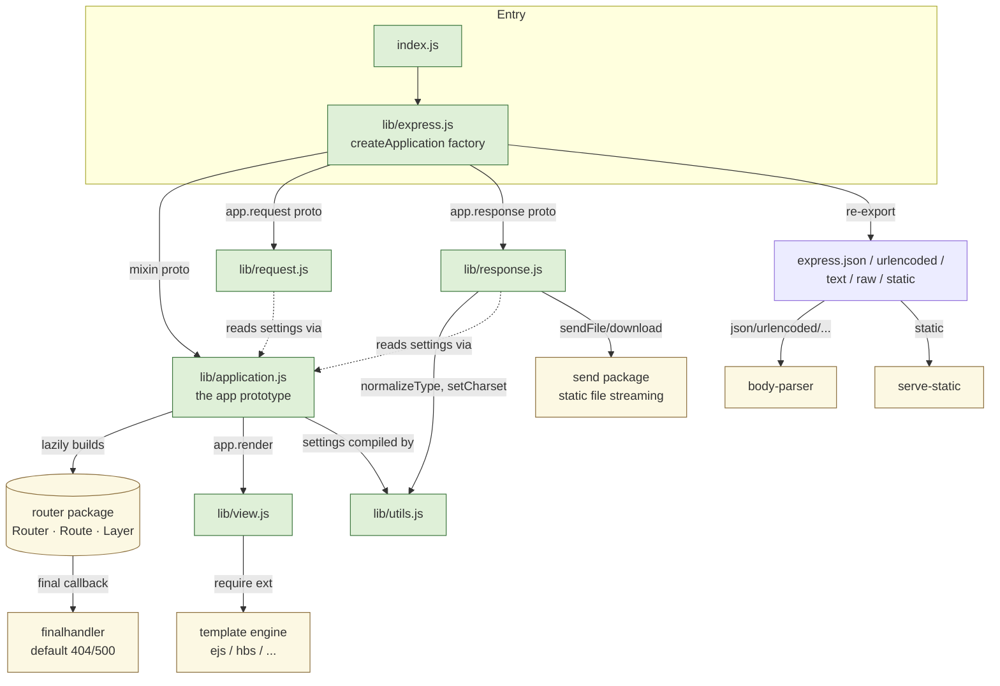
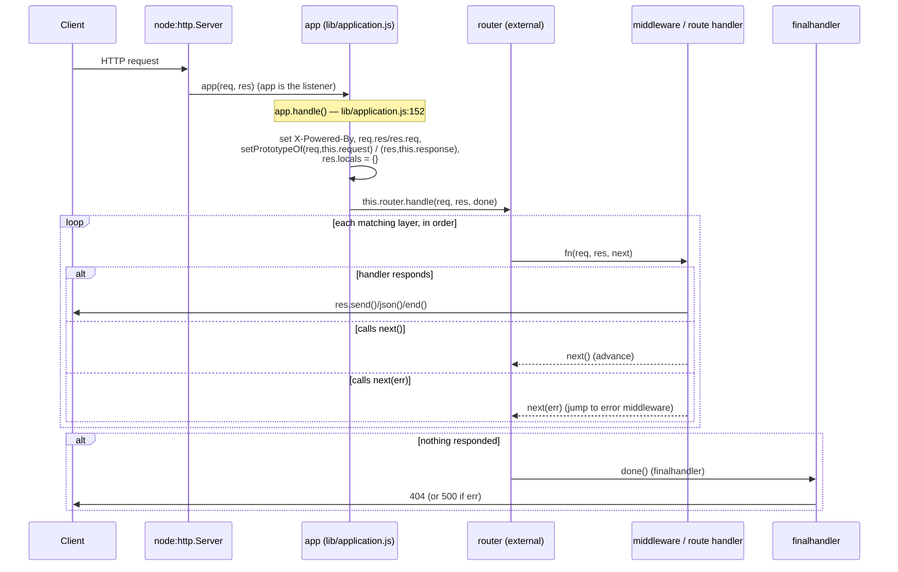

# 01 · The Big Picture

> **What you'll be able to answer after this chapter**
> - What are Express's major components and how are they separated? (Architecture)
> - Which direction do dependencies point, and what is Express's own code vs. delegated? (Architecture)
> - What are the load-bearing architectural decisions and their trade-offs? (Design rationale)
> - At a high level, how does one HTTP request flow through the system? (Control flow)

---

## The one-sentence architecture

**Express is a decoration-and-dispatch layer over `node:http`.** It (a) *decorates* Node's
raw `req`/`res` with a large convenience API by prototype substitution, and (b) *dispatches*
each request through an ordered middleware/route stack (the router). Everything else —
body parsing, static file serving, path matching, ETag generation, content negotiation —
is delegated to small, single-purpose npm packages that Express composes.

## The components

There are exactly five runtime objects you need to know, four of which are defined in
`lib/`:

| Component | File | Role |
|---|---|---|
| **Application** (`app`) | `lib/application.js` | The central object. Holds settings, the router, engines, locals; exposes `use`/`get`/`post`/`set`/`listen`/`render`; dispatches requests via `app.handle`. |
| **Request** (`req`) | `lib/request.js` | Prototype layered on `http.IncomingMessage`. Read-side helpers: `accepts`, `is`, `ip`, `host`, `protocol`, `query`, `params`, `fresh`. |
| **Response** (`res`) | `lib/response.js` | Prototype layered on `http.ServerResponse`. Write-side helpers: `send`, `json`, `jsonp`, `redirect`, `cookie`, `sendFile`, `render`, `status`, `set`. |
| **View** | `lib/view.js` | Resolves a template name to a file and invokes the registered engine. Backs `res.render`/`app.render`. |
| **Router / Route / Layer** | *external* `router` pkg | The dispatch engine: a stack of layers, path matching, params, `next`. Delegated to (`lib/application.js:26,74,177`). |

Plus two support files: `lib/express.js` (the factory + exports) and `lib/utils.js`
(pure helpers).

Green = Express's own code (`lib/`). Yellow = external packages Express composes.

## Dependency direction

The dependency arrows are strictly **inward from the edges toward `lib/application.js`**,
and **outward to leaf packages**:

- `index.js` → `lib/express.js` → (`lib/application.js`, `lib/request.js`,
  `lib/response.js`). The factory wires the three prototypes together.
- `lib/application.js` depends on `lib/view.js`, `lib/utils.js`, and the external
  `router`, `finalhandler`, `debug`, `once`.
- `lib/request.js` depends on `accepts`, `type-is`, `fresh`, `range-parser`, `parseurl`,
  `proxy-addr` (all external) plus `node:net`/`node:http`.
- `lib/response.js` depends on `send`, `cookie`, `cookie-signature`, `content-disposition`,
  `encodeurl`, `escape-html`, `etag`(via utils), `http-errors`, `mime-types`, `statuses`,
  `vary`, `on-finished`, `depd` plus `lib/utils.js`.
- `lib/utils.js` depends on `content-type`, `etag`, `mime-types`, `proxy-addr`, `qs`,
  `node:querystring`.

There are **no cycles between the `lib/` files** except the deliberate three-way wiring in
the factory. `request.js` and `response.js` never `require` each other or `application.js`;
they reach the app at runtime through `this.app` (set by the factory,
`lib/express.js:45-52`) and read settings via `this.app.get(...)`. This keeps the prototypes
decoupled and individually testable (see `test/req.*.js`, `test/res.*.js`).

## Express's code vs. what it delegates

A defining architectural choice of Express 5: **externalize almost everything into
focused packages.** The `lib/` code is glue and ergonomics; the heavy lifting lives in
dependencies (`package.json`). The full runtime dependency set and what each does:

| Package | Used by | Responsibility |
|---|---|---|
| `router` | `lib/application.js` | **Routing engine** — layer stack, path-to-regexp matching, params, `next('route')`/`next('router')`, error dispatch. |
| `body-parser` | `lib/express.js` (`json/raw/text/urlencoded`) | Request body parsing middleware. |
| `serve-static` | `lib/express.js` (`static`) | Static file serving middleware. |
| `send` | `lib/response.js` (`sendFile`/`download`) | Conditional/ranged file streaming with caching. |
| `finalhandler` | `lib/application.js` (`app.handle`) | The default end-of-stack handler → 404 / 500 responses + logging. |
| `accepts` | `lib/request.js` | Content negotiation for `req.accepts*`. |
| `type-is` | `lib/request.js` (`req.is`) | Content-Type matching. |
| `proxy-addr` | `lib/request.js`, `lib/utils.js` | `trust proxy` evaluation for `req.ip`/`ips`. |
| `parseurl` | `lib/request.js` | Cached URL parsing for `req.path`/`req.query`. |
| `range-parser` | `lib/request.js` (`req.range`) | `Range` header parsing. |
| `fresh` | `lib/request.js` (`req.fresh`) | Conditional-GET freshness (ETag/Last-Modified). |
| `etag` | `lib/utils.js` | ETag generation (strong/weak). |
| `qs` | `lib/utils.js` | Extended (nested) query string parsing. |
| `content-type` | `lib/utils.js` (`setCharset`) | Content-Type parse/format. |
| `content-disposition` | `lib/response.js` | `Content-Disposition` header for downloads/attachments. |
| `cookie` | `lib/response.js` (`res.cookie`) | Cookie serialization. |
| `cookie-signature` | `lib/response.js` (`res.cookie`) | Signed cookies. |
| `encodeurl` | `lib/response.js` (`location`/`redirect`) | Safe URL encoding of redirect targets. |
| `escape-html` | `lib/response.js` (redirect HTML body) | HTML entity escaping. |
| `mime-types` | `lib/response.js`, `lib/utils.js` | Extension ↔ MIME mapping. |
| `statuses` | `lib/response.js` | HTTP status code → reason phrase. |
| `http-errors` | `lib/response.js` (`res.format`) | Construct `HttpError` (e.g. 406). |
| `vary` | `lib/response.js` (`res.vary`) | Manage the `Vary` header. |
| `on-finished` | `lib/response.js` (`sendfile`) | Detect response completion. |
| `merge-descriptors` | `lib/express.js` | Mix EventEmitter + app proto onto the app function. |
| `once` | `lib/application.js` (`app.listen`) | One-shot listen callback. |
| `depd` | `lib/response.js` | Deprecation warnings (`res.redirect` misuse). |
| `debug` | `lib/application.js`, `lib/view.js` | Namespaced debug logging (`express:*`). |

> **Why this matters for reasoning about the system:** many "Express behaviors" are
> actually behaviors of a dependency. For example, exactly *which* dotfiles `express.static`
> serves, or how `:id?` optional params match, is defined by `serve-static` / `router`,
> not by any file in this repo. This book grounds those contracts in the **tests** (which
> pin the observable behavior) and labels the mechanism as living in the external package.

## The v4 → v5 architectural shift (design rationale)

`History.md` records why the code looks the way it does. The Express 5 line made several
architecture-defining changes (`History.md`, `5.0.0` and `5.0.0-beta.1` sections):

- **Router extracted to its own package** (`router@2`). In v4 the router lived in
  `lib/router/`. In v5 it's the external `router` dependency, lazily instantiated
  (`lib/application.js:69-82`). Trade-off: cleaner separation and independent releases, at
  the cost of the routing internals no longer being in this repo.
- **path-to-regexp modernized** (v8 via `router@2`). New `?`, `*`, `+` parameter modifiers;
  regexes only allowed inside matching groups; named groups no longer available *by
  position* in `req.params`; the special `*` path segment behavior changed. This is the
  most common source of v4→v5 breakage. → Chapter 4.
- **Signature overloads removed.** `res.send(status, body)`, `res.json(status, obj)`,
  `res.redirect(url, status)`, `res.jsonp(status, obj)` are gone; you now write
  `res.status(s).send(body)`. `res.status()` accepts only integers 100–999 and throws
  otherwise (`lib/response.js:65-77`).
- **`res.redirect('back')`/`res.location('back')` magic string removed** — use
  `req.get('Referrer') || '/'` (`History.md`, 5.0.0). `lib/response.js:797` (`res.location`)
  no longer special-cases `'back'`.
- **Default `query parser` is `'simple'`** (Node's `querystring`) rather than `'extended'`
  (`qs`) — `lib/application.js:97`, `lib/utils.js:162-184`. Less surprising, avoids `qs`
  prototype-pollution surface by default.
- **body-parser 2.x**: `req.body` is no longer always initialized to `{}`; `urlencoded`
  defaults `extended:false`. → Chapter 8.
- **Dependencies removed/inlined**: `setprototypeof`, `safe-buffer`, `utils-merge`,
  `methods`, `path-is-absolute`, `depd`(partially) — replaced by native equivalents
  (`Object.setPrototypeOf`, `node:buffer`, spread, `require('node:http').METHODS`,
  `path.isAbsolute`) (`History.md`, 5.1.0 / 5.0.0). This is why `lib/utils.js:29` derives
  the method list from `node:http` directly.
- **Node 18+ required** (`package.json` `engines`).

## How a request flows (high level)

Later chapters zoom into each step; here is the whole journey once.

Concretely: a `GET /` on a hello-world app enters `app(req,res)` →
`app.handle` sets `X-Powered-By: Express` (`lib/application.js:160-162`), links
`req.res`/`res.req`, swaps the prototypes, ensures `res.locals`, then calls
`this.router.handle` (`lib/application.js:177`). The router finds the `GET /` route,
invokes its handler `(req,res)`, the handler calls `res.send('Hello World')`
(`lib/response.js:126`), which sets `Content-Type: text/html; charset=utf-8`, computes
`Content-Length`, generates an ETag, and calls `res.end(...)`. Done — the loop never
reaches `finalhandler`. → [Chapter 10](10-key-flows.md) traces this and other flows with
real header values.

## Load-bearing architectural decisions & trade-offs

1. **The app is a callable function, not an instance.** `createApplication` returns a
   closure `function(req,res,next){ app.handle(...) }` with prototypes mixed in
   (`lib/express.js:36-56`). *Why:* it can be passed straight to `http.createServer(app)`
   and to `app.use(subapp)` uniformly, and multiple apps can be composed. *Trade-off:* `app`
   is not a normal class instance; you extend it by mutating the shared `proto` object, and
   `instanceof` doesn't apply. (Inference from the factory shape.)

2. **Prototype substitution instead of wrapping.** `app.handle` does
   `Object.setPrototypeOf(req, this.request)` per request (`lib/application.js:169-170`)
   rather than allocating wrapper objects. *Why:* zero per-request allocation for the API
   surface, and native `req`/`res` behavior is preserved untouched. *Trade-off:* mutating an
   object's prototype is a known V8 de-opt, and the API "appears" on `req`/`res` only *after*
   `app.handle` runs — before that (e.g. a raw `http` listener) the methods aren't there.

3. **Lazy, single router per app.** The router is built on first access via a getter
   (`lib/application.js:69-82`) using the app's `case sensitive routing` / `strict routing`
   settings at that moment. *Why:* apps that never route (used purely as middleware) pay
   nothing; and those two settings must be fixed at router-construction time. *Trade-off:*
   changing `case sensitive routing` *after* the first route is registered has no effect
   (the router already exists). → Chapter 3.

4. **Settings compiled to functions on write.** `app.set('etag'|'query parser'|'trust
   proxy', v)` immediately compiles a `… fn` (`lib/application.js:363-380`,
   `lib/utils.js`). *Why:* the hot path (`req.ip`, `res.send` ETag, `req.query`) reads a
   ready-made function instead of re-interpreting a config value per request. *Trade-off:*
   two coupled keys per setting (`etag` + `etag fn`), and the compile happens eagerly.

5. **Delegate everything focused.** Body parsing, static serving, path matching, etc. are
   external packages. *Why:* smaller core, independent security patching, reuse outside
   Express. *Trade-off:* behavior is spread across ~28 packages; a bug or CVE (see the
   `cookie`/`qs` notes in `History.md`) may live in a dependency, and this repo can't fully
   document those internals.

6. **Mounted sub-apps inherit via prototype chains.** On `'mount'`, a child app sets its
   `request`/`response`/`settings`/`engines` prototypes to the parent's
   (`lib/application.js:117-121`). *Why:* configuration flows down without copying.
   *Trade-off:* child settings shadow but are wired by live prototype links, so parent
   changes can surface in children. → Chapter 3.

## Where to look

- `lib/express.js` — the factory; the shape of `app`; the exports.
- `lib/application.js:59` (`init`), `:90` (`defaultConfiguration`), `:152` (`handle`),
  `:69` (lazy router getter).
- `package.json` `dependencies` — the delegation surface.
- `History.md` — the "why v5 looks like this" record.

## Open questions

- The *internal* dispatch algorithm of the `router` package (layer matching order, regex
  compilation) is not in this repo. Chapter 4 grounds its **observable contract** in
  `test/Router.js`/`test/Route.js`/`test/app.router.js` and labels deeper internals as
  belonging to `router@2`.

**Next:** [02 · Core Concepts & Domain Model](02-core-concepts.md).
