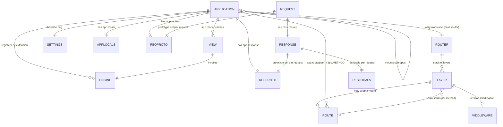
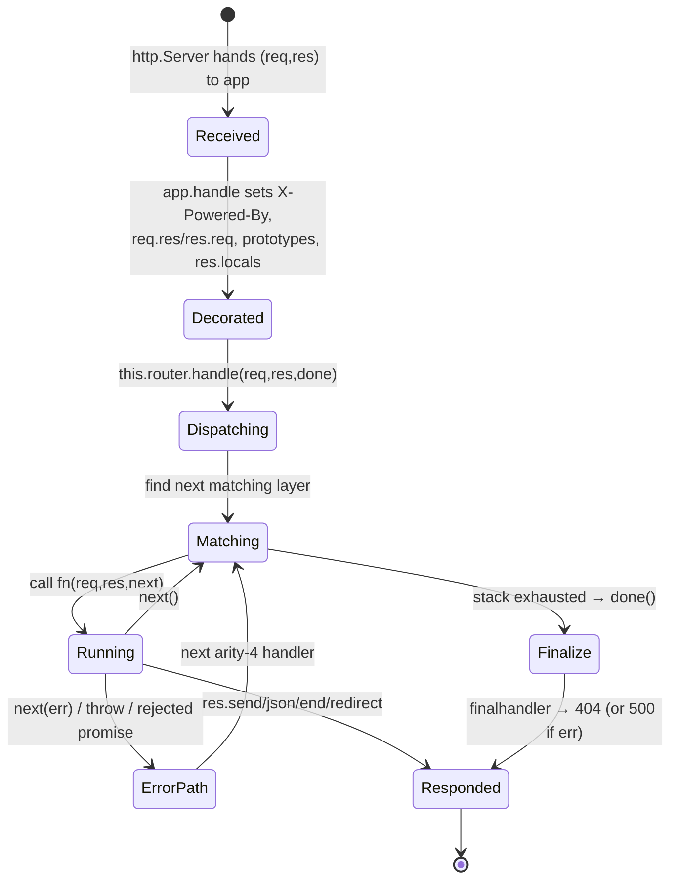

# 02 · Core Concepts & Domain Model

> **What you'll be able to answer after this chapter**
> - What are the core nouns of Express and precisely what does each mean *in this codebase*? (Domain)
> - How do `app`, `req`, `res`, `Router`, `Route`, `Layer`, middleware, settings, locals, and views relate? (Domain / Architecture)
> - What are the exact meanings of `next()`, `next('route')`, `next('router')`, and `next(err)`? (Control flow)

This is the vocabulary chapter. Every later chapter uses these terms precisely; define them once here and the rest reads cleanly.

## The object graph

## The nouns

### Application (`app`)
The central object returned by `express()`. It is **three things fused together**
(`lib/express.js:36-56`):
1. a **function** `(req, res, next) => app.handle(req, res, next)` you can hand to
   `http.createServer` or to another app's `app.use` (`lib/express.js:37-39`);
2. an **EventEmitter** (via `mixin(app, EventEmitter.prototype)`, `lib/express.js:41`) — it
   emits `'mount'` when mounted into a parent;
3. a **settings-and-methods bag** (via `mixin(app, proto)` where `proto` is
   `lib/application.js`, `:42`) — it carries `settings`, `locals`, `engines`, `cache`, the
   lazy `router`, and every method (`use`, `get`, `set`, `listen`, `render`, …).

An app owns: a **settings** bag, **app.locals**, an **engines** registry, a **view cache**,
one lazily-built base **Router**, and two per-app prototypes **`app.request`** /
**`app.response`** (`lib/express.js:45-52`, `lib/application.js:62-64`).

### Middleware
A function `(req, res, next)` registered on the app/router. It runs when a request matches
its (optional) mount path, in registration order. It can: read/modify `req`/`res`, end the
response, call `next()` to pass control on, or call `next(err)` to signal an error. This is
the atomic unit of an Express app. Example: `express.json()` returns a middleware that
populates `req.body`.

### Route handler
A middleware bound to a specific **HTTP method + path**, registered via `app.get(path, fn)`,
`app.post(...)`, `route.put(...)`, etc. Same `(req, res, next)` signature; the difference is
only *when* it matches. `app.get('/users/:id', handler)` runs `handler` for
`GET /users/42` with `req.params.id === '42'`.

### Error-handling middleware
A middleware with **exactly four declared parameters** `(err, req, res, next)`. The router
routes an active error only to arity-4 functions and skips ordinary middleware while an
error is "in flight" (grounded: `test/app.routes.error.js:25-60`, `test/Router.js:209-230`).
Its arity — `fn.length === 4` — is the *only* thing that marks it as an error handler.

### Router
The dispatch engine. It holds an **ordered stack of Layers** and, on `router.handle(req,
res, done)`, walks that stack calling each matching layer's handler with `(req, res, next)`.
**In Express 5 the Router is the external `router` package** (`package.json` `router@^2.2.0`;
`express.Router === require('router')`, `lib/express.js:19,71`). Each app lazily builds one
base router (`lib/application.js:69-82`); you can also create standalone routers with
`express.Router()` and mount them with `app.use('/path', router)`.

### Route (the `Route` object)
An **isolated middleware stack for one specific path**, returned by `app.route(path)` or
`express.Route`. It has per-method handlers (`route.get(fn)`, `route.post(fn)`, `route.all(fn)`).
`app.get('/x', fn)` is sugar for `app.route('/x').get(fn)` (`lib/application.js:478-479`).
A Route lets you attach several methods to one path without repeating the path
(`test/app.route.js`).

### Layer
The internal pairing of a **path matcher** (compiled from the path pattern via
path-to-regexp) with a **handler** (a middleware, or a Route's dispatch). Layers live inside
the `router` package and are not defined in this repo; you observe their behavior through
the tests. A layer either wraps plain middleware (registered via `use`) or a Route
(registered via `METHOD`/`all`).

### Settings
The per-app configuration bag `app.settings` (a null-prototype object,
`lib/application.js:64`). Read/write with `app.set(name, val)` / `app.get(name)` /
`app.enable` / `app.disable` / `app.enabled` / `app.disabled`
(`lib/application.js:351-465`). A handful of keys are **compiled** into companion function
keys on write: `etag`→`etag fn`, `query parser`→`query parser fn`, `trust proxy`→`trust
proxy fn` (`lib/application.js:363-380`). Full catalog in [Chapter 3](03-the-application-object.md#the-complete-settings-catalog).

### Locals
Two distinct null-prototype objects, both merged into template rendering:
- **`app.locals`** — application-wide template variables, persisting across requests
  (`lib/application.js:125`). Always contains `settings` (`:131`).
- **`res.locals`** — per-request template variables, created fresh in `app.handle`
  (`lib/application.js:173-175`). Reset every request; the place to stash per-request data
  (e.g. the current user) for views.
Precedence in `app.render`: `app.locals` < `opts._locals` < `opts` (`lib/application.js:536`).

### View & Engine
A **View** (`lib/view.js`) is an object that knows how to turn a template *name* into a
rendered string: it resolves the name to a file on disk and calls the registered engine.
An **engine** is any function with the signature `(path, options, callback)` registered via
`app.engine(ext, fn)` (`lib/application.js:294-308`). Express ships none of its own; it
adapts to whatever you register (EJS, Handlebars, Pug via their `__express` export). →
[Chapter 7](07-views-and-rendering.md).

### Request (`req`) & Response (`res`)
`req` and `res` are Node's native `http.IncomingMessage` / `http.ServerResponse` objects
whose **prototype has been re-pointed** at Express's augmented prototypes
(`lib/application.js:169-170`). So they are the *same* objects Node created, now carrying
Express's methods by inheritance. `req.res` and `res.req` cross-link them
(`lib/application.js:165-166`), and `req.app`/`res.app` point back at the application
(`lib/express.js:46,51`).

## The mechanisms

### Prototype augmentation (the core trick)
Express never copies or wraps `req`/`res`. `lib/request.js` is
`Object.create(http.IncomingMessage.prototype)` (`:30`) and `lib/response.js` is
`Object.create(http.ServerResponse.prototype)` (`:43`). Per request, `app.handle` runs
`Object.setPrototypeOf(req, this.request)` / `(res, this.response)`
(`lib/application.js:169-170`), inserting Express's prototype *between* the object and
Node's prototype. Result: `req`/`res` keep native behavior and gain Express's API with zero
allocation. `this.request`/`this.response` are per-app (`lib/express.js:45-52`) so different
apps can have different augmentations, and mounting chains them (`lib/application.js:118-119`).

### `next` and its magic strings
`next` is the function passed to every middleware to advance dispatch. Its argument selects
one of four behaviors (all grounded in `test/app.router.js` / `test/Router.js`):

| Call | Meaning | Grounded at |
|---|---|---|
| `next()` | Advance to the **next matching layer** in the current stack. | `test/app.router.js:144-167` |
| `next('route')` | Skip the **rest of the current Route's handlers**; jump to the next matching route. | `test/app.router.js:848-869` |
| `next('router')` | Exit the **entire current (sub)router**; return control to the parent stack. | `test/app.router.js:872-901` |
| `next(err)` (any other truthy value) | Treat as an **error**; jump to the next **error-handling** (arity-4) middleware. | `test/app.router.js:903-936` |

A thrown exception (or a returned rejected Promise) inside a handler is caught by the router
and converted into `next(err)` automatically (`test/Route.js:197-221`,
`test/app.router.js:965-1046`). A *resolved* Promise is ignored — returning a resolved
promise does **not** auto-call `next` (`test/app.router.js:1004-1022`).

### Mounting & sub-apps
`app.use('/admin', subApp)` mounts one app inside another. Express detects a sub-app by duck
typing (`fn.handle && fn.set`, `lib/application.js:221`), sets `subApp.mountpath = '/admin'`
and `subApp.parent = app` (`:226-227`), wraps it so `req`/`res` prototypes are **restored to
the parent** when the sub-app finishes (`:230-237`), and emits `'mount'` on the sub-app
(`:240`). On `'mount'`, the sub-app links its `request`/`response`/`settings`/`engines`
prototypes to the parent's (`:117-121`), so configuration flows downward. `app.path()`
walks `parent`+`mountpath` to compute the absolute mount path (`:399-403`).

### Settings compilation
When you write a "special" setting, Express eagerly compiles a fast function so the hot path
doesn't re-interpret config per request (`lib/application.js:363-380`, `lib/utils.js`):
- `etag` → `etag fn` (strong/weak/custom generator) — used by `res.send` (`lib/response.js:162`).
- `query parser` → `query parser fn` (simple/extended/custom/off) — used by `req.query` (`lib/request.js:231`).
- `trust proxy` → `trust proxy fn` (predicate over address + hop index) — used by `req.ip`,
  `req.protocol`, `req.host`, etc. (`lib/request.js:301,341,419`).

## The request lifecycle in one glance

## Where to look

- `lib/express.js` — how `app`, `app.request`, `app.response` are constructed and fused.
- `lib/application.js:152-178` — `app.handle`, where decoration + dispatch happen.
- `test/app.router.js`, `test/Router.js`, `test/Route.js` — the executable definition of
  routing, `next`, params, and error dispatch.

## Open questions

- The `Layer` object and the precise layer-matching order are internal to the `router`
  package (not in this repo); their behavior is pinned by the routing tests and explained at
  contract level in [Chapter 4](04-routing-and-middleware.md).

**Next:** [03 · The Application Object](03-the-application-object.md).
