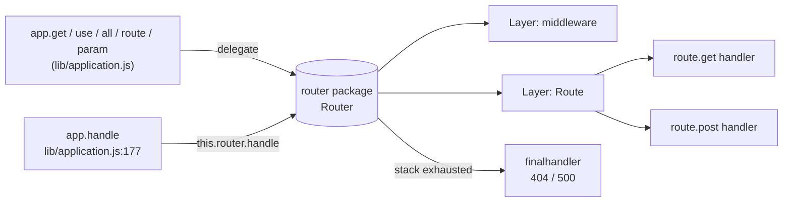
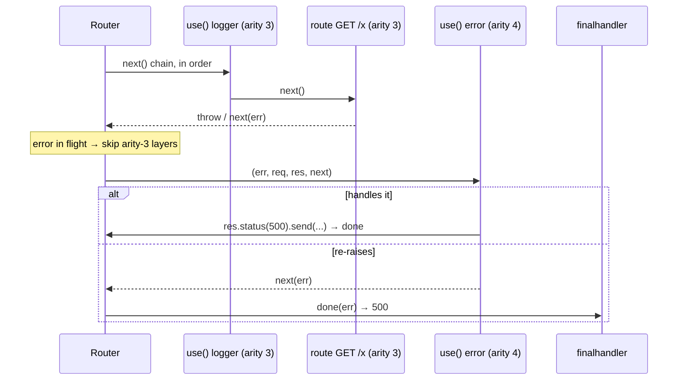

# 04 · Routing & Middleware

> **What you'll be able to answer after this chapter**
> - How does Express dispatch a request through middleware and routes, in what order? (Control flow)
> - What do `next()`, `next('route')`, `next('router')`, and `next(err)` do exactly? (Control flow)
> - How does path matching work in Express 5 (params, optional groups, splats, regex, case/strict)? (Interfaces)
> - How are `req.params` populated, restored, and merged across nested routers? (State)
> - How do errors propagate, and what does the automatic OPTIONS/HEAD handling do? (Failure)

**The boundary up front:** In Express 5, routing is the **external `router` package**
(`package.json` `"router": "^2.2.0"`). `express.Router === require('router')` and
`express.Route === Router.Route` (`lib/express.js:19,70-71`). Express's own code
(`lib/application.js`) is a thin adapter: it builds one base router, proxies
`use`/`route`/`param`/`all`/VERB to it, and dispatches from `app.handle`. Because
`node_modules` is absent from this checkout, **the router's internal algorithm is not
readable here** — but the repo's `test/Router.js`, `test/Route.js`, `test/app.router.js`,
`test/app.param.js`, and friends exercise it directly and are the grounded contract. Every
behavior below cites those tests.

---

## 1. Where routing lives, and Express's thin adapter



The app's base router is built lazily on first access (`lib/application.js:69-82`), reading
two settings **once**:

```js
router = new Router({
  caseSensitive: this.enabled('case sensitive routing'),  // :75
  strict:        this.enabled('strict routing')            // :76
});
```

The adapter methods (all in `lib/application.js`):
- `app.use([path], ...fns)` → `router.use(path, fn)` (or wraps a sub-app) — `:190-244`.
- `app.get/post/put/...(path, ...h)` → `this.route(path)[method](...h)` — `:471-482`.
- `app.all(path, ...h)` → registers on every method — `:494-503`.
- `app.route(path)` → `this.router.route(path)` — `:256-258`.
- `app.param(name, fn)` → `this.router.param(name, fn)` (array form recurses) — `:322-334`.

## 2. The dispatch pipeline

An Express app is **one ordered stack of layers**. `app.use`, `app.get`, `app.all`, and
mounted routers all register into that single stack **in registration order**, and dispatch
walks it top to bottom. Middleware and routes interleave freely; there is no "middleware
phase then routes phase."

Grounded: `test/app.router.js:1115-1152` registers a mix of `use`/`get`/`all`/splat layers
and asserts `GET /user/1` produces the body `'0,1,2,3,4,5'` — i.e. each layer ran in the
exact order registered. `test/middleware.basic.js:9-40` asserts two `app.use` middlewares
run in order (`['one','two']`) before the terminal handler.

Each layer whose matcher matches the current method+URL is invoked as `fn(req, res, next)`.
The layer either:
1. **responds** (`res.send`/`json`/`end`/`redirect`) — dispatch effectively stops for that
   request;
2. **calls `next()`** — advance to the next matching layer; or
3. **calls `next(err)`** / throws / returns a rejected promise — jump to error handling.

If the stack is exhausted with no response, the router calls the `done` callback, which is
`finalhandler` (`lib/application.js:154-157`) → a **404** (or **500** if an error was in
flight).

### The four `next` behaviors

| Call | Effect | Grounded at |
|---|---|---|
| `next()` | Advance to the next matching layer. Non-matching routes are skipped. | `test/app.router.js:818-846` |
| `next('route')` | Skip the remaining handlers **in the current Route**; go to the next matching route. | `test/app.router.js:848-869` |
| `next('router')` | Exit the **entire current (sub)router**; hand control back to the parent stack. | `test/app.router.js:872-901` |
| `next(err)` | Jump to the next **error-handling** (arity-4) middleware. | `test/app.router.js:903-936` |

Concrete traces from the tests:
- **`next('route')`**: two routes both match `/foo`; the first route's handler sets header
  `X-Hit` then calls `next('route')`. The sibling handler *after* it in the same route is
  **skipped**, and the second `/foo` route sends `'success'`
  (`test/app.router.js:848-869`).
- **`next('router')`**: inside a mounted sub-router, a middleware calls `next('router')`; both
  `/foo` routes *inside that router* are bypassed and control lands on the parent app's
  `app.get('/foo')` → `'success'` (`test/app.router.js:872-901`).
- **`next(err)`**: the next ordinary `/foo` route is skipped, and the error middleware sees
  the accumulated `calls` list (`test/app.router.js:903-936`). If an arity-4 handler exists
  *in the same route*, it runs there first (`test/app.router.js:938-962`).

### Errors are caught and converted to `next(err)`

The router wraps handler invocation in try/catch and treats a **thrown error** or a
**returned rejected Promise** as `next(err)`:
- Thrown in a handler → error dispatch (`test/Route.js:197-221`).
- Thrown in a param callback → error dispatch, surfaces as 500 (`test/app.param.js:179-194`).
- Thrown *inside* an error handler → propagates to the *next* error handler
  (`test/Route.js:223-245` → body `'oops'`).
- **Returned rejected Promise** → `next(err)` (`test/app.route.js:65-196`); a rejection with
  no value synthesizes `Error('Rejected promise')` (`test/app.router.js:985-1002`).
- **Returned resolved Promise** → *ignored*; `next` is **not** auto-called
  (`test/app.router.js:1004-1022`). So `async` handlers that resolve must still respond or
  call `next()` themselves.

### Error-handling middleware = arity 4

The router selects error handlers purely by **function arity**: a middleware declared with
four parameters `(err, req, res, next)` is an error handler; anything else is ordinary. While
an error is in flight, ordinary (arity-3) middleware is **skipped** and only arity-4 handlers
run (`test/app.routes.error.js:25-60`, `test/Router.js:209-230`). An error handler can
"resolve" the error by calling `next()` with no argument, which returns dispatch to the
normal (arity-3) flow (`test/app.routes.error.js`). Placing error middleware **last** is the
convention (`examples/error/index.js:20-47`).



## 3. Path matching (Express 5 / path-to-regexp v8)

Express 5 upgraded to path-to-regexp v8 (via `router@2`), which **changed the path syntax**
— the single most common source of v4→v5 breakage. All behaviors below are grounded in
`test/app.router.js`.

### Named parameters `:name`
- Match a **single path segment**; an extra segment 404s (`:592-615`).
- Multiple params: `/user/:user/:op` (`:617-627`).
- Populated **URL-decoded**: `/foo%2Fbar` → `req.params` value `'foo/bar'` (`:95-105`),
  `%ce%b1` → `'α'` (`:131-141`). `+` is **not** decoded → stays `'foo+bar'` (`:119-129`).
- **Malformed percent-encoding** in the path (e.g. `/%foobar`) → **400**, params not populated
  (`:107-117`).

### Optional segments use `{...}` braces (not `?`)
This is the headline v5 change. Old `:name?` is replaced by brace groups:
- `/user/:user{/:op}` — `op` optional (`:676-702`).
- `/:name{.:format}` — optional `.format` suffix (`:799-816`).
- `/foo{/:bar}` — optional `/:bar` (`:823`).
- Literal-optional groups: `/user{s}/:user/:op` matches both `/user/...` and `/users/...`
  (`:629-644`).

### Splats / wildcards use `*name` (yielding an array)
- `/user/*user` captures **an array**: one segment → `req.params.user[0]`; many →
  `req.params.user.join('/')` (`:704-727,742-765`).
- A bare `*name` matches **1+ segments, not zero** → missing 404s (`:767-777`). To allow zero,
  wrap it optional: `/user{/*user}` (`:729-739`).
- Full-path splats: `/*path`, `/*splat` (`:1119,1139`).

### Regular-expression routes
- A `RegExp` route matches the **pathname only**, ignoring the query string (`:169-180`).
- Numbered captures → `req.params[0]`, `[1]`, … (`:182-194`); named groups `(?<userId>…)` →
  `req.params.userId` (`:196-211`).
- In `app.use`, a RegExp is **anchored to the path start** (a prefix match): `/test/api/1234`
  matches `/\/test/` but not `/\/api.*/` (`:213-240`). `/^\/[a-z]oo/` matches `/foo` and
  `/zoo/bear`, stripping the matched prefix from `req.url` (`/zoo/bear` → `/bear`)
  (`test/app.use.js:505-528`).

### Literals, escapes, arrays
- Literal dots: `/api/users/:from..:to` matches `/1..50` (`:577-590`); `/:name.:format`
  requires the format, so `/foo` 404s (`:780-797`).
- Escaped parens are literal: `/:user\(:op\)` matches `/tj(edit)` (`:646-656`).
- Array of paths: `['/user/:user/poke','/user/:user/pokes']` registers both (`:658-673`).

### Case sensitivity & strict routing
- **Case insensitive by default**: `/USER` ≡ `/user` (`:243-254`).
  `app.enable('case sensitive routing')` → exact match (`:256-284`).
- **Non-strict by default**: trailing slash optional, `/user/` ≡ `/user` (`:423-434`).
  `app.enable('strict routing')` → `/user/` ≠ `/user` (each 404s the other, `:436-574`).
- **Middleware mount paths are exempt** from strict trailing-slash rules: `app.use('/user/')`
  matches `/user`, and `app.use('/user')` matches both `/user` and `/user/`
  (`test/app.router.js:505-545`).
- Both settings are captured at router construction (`lib/application.js:75-76`) — set them
  before the first route.

## 4. `req.params`, URL mutation, and mergeParams

**Population & decoding** — see §3 (decoded, `+` preserved, malformed → 400).

**Restoration after leaving a router/route.** Params are scoped: after control leaves a
nested router or route, the parent's `req.params` are restored. In
`test/app.router.js:12-37`, `app.get('/user/:id', handler1, subRouter, handler2)` — inside
`subRouter`, `req.params.id` is `undefined` (the sub-router's params overwrite), but
`handler2` (back in the parent) sees `'1'` again. Header assertions:
`x-router: 'undefined'`, `x-user-id: '1'`, body `'1'`.

**`req.url` mutation on mount.** When a middleware/router is mounted at a path, the matched
prefix is **stripped** from `req.url` for the duration of that sub-stack, then restored:
- `app.use('/foo')` + request `/foo/bar` → inside, `req.url === '/bar'`
  (`test/app.use.js:284-294`); after, it's restored for later non-matching layers
  (`test/Router.js:401-405`).
- FQDNs are preserved: `use('/blog')` on `http://example.com/blog/post/1` → inside,
  `req.url === 'http://example.com/post/1'` (host kept, `/blog` stripped)
  (`test/Router.js:345-360`).
- **`req.originalUrl`** always holds the full original URL, unchanged across dispatch
  (`test/app.use.js:453,485`). **`req.baseUrl`** holds the mount path of the current
  router/route (set by the router package; see `test/req.baseUrl.js` for values like
  `/foo/bar/baz` under nested mounts).
- Handlers may rewrite `req.url` (`test/app.router.js:1097-1113`) or `req.method`
  (POST→DELETE, `:64-91`) to re-route.

**mergeParams.** By default a nested `Router` **overwrites** the parent's params
(`test/app.router.js:287-301` → only the child's `{action}`). Constructing the router with
`mergeParams: true` merges the parent's params in (`:303-317` → both `action` and `user`); a
child key with the same name as a parent key wins (`:319-333`). Invalid incoming `req.params`
values are ignored (`:383-400`).

## 5. `app.param(name, fn)` — parameter preprocessing

`app.param('user', fn)` registers a preprocessor that runs when a route with `:user`
matches. Signature: `fn(req, res, next, value)` (`test/app.param.js:43`). The array form
`app.param(['from','to'], fn)` registers the same fn for each name
(`lib/application.js:323-329`).

Semantics (all from `test/app.param.js`):
- **Fires only when a matching route with that param actually runs.** If `:user` param is
  registered but the only `/:user` route is `POST`-only and the request is `GET`, the param
  never fires (`:136-159`).
- **Once per request per value.** Two routes sharing `:user` with the same value → the param
  callback runs **once** (`:60-86`). If the value differs across routes (`/:user/bob` then
  `/foo/:user`), it runs again (`:88-114`).
- May mutate `req.params` (`:116-134` sets `user='loki'`, seen downstream).
- May call `next('route')` to defer to the next route (`:217-236`).
- A thrown error → 500 (`:179-194`); values arrive **decoded** (`/user/foo%25bar` → `'foo%bar'`,
  `:161-177`).
- Parallel requests don't cross-contaminate param state (`test/Router.js:599-635`).

Example (`examples/params/index.js:23-41`):

```js
app.param('user', function(req, res, next, id){
  users.find(id, function(err, user){
    if (err) return next(err);
    if (!user) return next(createError(404, 'failed to find user'));
    req.user = user;         // attach loaded entity for downstream handlers
    next();
  });
});
app.get('/user/:user', function(req, res){ res.send('user ' + req.user.name) });
```

## 6. The `Route` object

`app.route(path)` (or `express.Route`) returns an isolated per-path stack:

```js
app.route('/users')
   .get(list)
   .post(create)
   .all(logAccess);   // .all matches every method for this path
```

- `route.all(fn)` runs for every method, including requests with no `req.method`
  (`test/Route.js:64-89`); `route.VERB(fn)` requires a method match (`:106-168`).
- Handlers chain and fall through in order: `get → all → get` on a GET yields `'abc'`
  (`test/Route.js:143-167`).
- An empty route (no handlers) → 404 (`test/app.route.js:55-63`).
- `app.get('/x', fn)` is exactly `app.route('/x').get(fn)` (`lib/application.js:478-479`).

## 7. Automatic HEAD, OPTIONS, and the absence of 405

These are provided by the `router` package; pinned by `test/app.head.js` /
`test/app.options.js`.

- **HEAD is served by GET routes** automatically. `app.get('/tobi', …)` answers a HEAD
  request with 200 and headers identical to the GET (minus body); `res.send` detects HEAD and
  omits the body (`lib/response.js:211-213`; `test/app.head.js:7-44`). An explicit
  `app.head('/tobi', …)` overrides the GET for HEAD (`:47-65`).
- **OPTIONS is auto-answered** with an `Allow` header listing the methods defined for that
  path (HEAD auto-added when GET exists), and the body is the same list — e.g.
  `Allow: GET, HEAD, PUT` (`test/app.options.js:7-18`). Each method appears once (`:20-32`).
  `app.all(...)` middleware **runs** during OPTIONS but does **not** contribute to the `Allow`
  list (`:34-50`). No matching path → 404 (`:52-60`). OPTIONS aggregates methods across
  mounted routers (`:62-74`). An `app.options(path, fn)` overrides the default entirely
  (`:99-116`).
- **There is no automatic 405.** A request to a path that exists but with an unregistered
  method yields **404**, not 405 (`test/app.options.js:52-60`, `test/app.router.js:80-82`).

## 8. Mounting middleware & sub-apps via `app.use`

Recap of the adapter (full mechanism in [Chapter 3 §6](03-the-application-object.md#6-mounting--inheritance)):
- Path defaults to `'/'` (`lib/application.js:192`); args are flattened `Infinity`-deep
  (`:210`); zero functions → `TypeError('app.use() requires a middleware function')`
  (`:212-214`).
- **Plain middleware** (no `.handle`/`.set`) → `router.use(path, fn)` (`:221-222`).
- **Sub-app** (has `.handle` && `.set`) → mountpath/parent set, wrapped so prototypes restore
  on exit, `'mount'` emitted (`:226-240`).
- Two different "missing handler" errors: `app.use('/')` with no fn throws Express's
  `app.use() requires a middleware function`, while `app.use('/', badFn)` throws the
  *router's* `argument handler must be a function` (`test/app.use.js:259-282`).

Real mounting recipes from the examples:
- Prefix-mount a router module: `app.use('/api/v1', require('./controllers/api_v1'))`
  (`examples/multi-router/index.js:7-8`).
- Prefix-mount an API-key guard: `app.use('/api', fn)` reading `req.query['api-key']`
  (`examples/web-service/index.js:30-42`).
- Static under a prefix: `app.use('/static', express.static(dir))` strips `/static`
  (`examples/static-files/index.js:30`).

## 9. Robustness: no stack overflow, deferred dispatch

The router dispatches iteratively/deferred, not by deep synchronous recursion. Tests register
**6000** middlewares/handlers and confirm no stack overflow (`test/Router.js:91-160`,
`test/Route.js:16-45`). Async params across parallel requests keep per-request state
separate (`test/Router.js:599-635`). A `throw` *after* `res.end()` must not corrupt the
already-sent response (`test/regression.js:6-20` — handler `res.end('yay')` then
`throw` still yields `200 'yay'`).

## 10. Traced example: a request through a mounted router with a param

```js
const app = express();
const users = express.Router();
users.param('id', (req, res, next, id) => { req.userId = Number(id); next(); });
users.get('/:id', (req, res) => res.json({ id: req.userId }));
app.use('/users', users);           // mount
// GET /users/42
```

Step by step:
1. `app(req,res)` → `app.handle` decorates `req`/`res`, calls `this.router.handle`
   (`lib/application.js:177`).
2. The base router matches the layer mounted at `/users`; it **strips** `/users` from
   `req.url` (now `/42`), sets `req.baseUrl = '/users'`, and enters the `users` sub-router.
3. The `users` router matches `GET /:id`; before the handler, the `id` param callback runs
   once with value `'42'` (decoded), sets `req.userId = 42`, calls `next()`.
4. The handler runs: `res.json({ id: 42 })` → `Content-Type: application/json; charset=utf-8`,
   body `{"id":42}`.
5. Dispatch unwinds; `req.url`/`req.params` are restored for any later parent layers; none
   respond further, so the response is complete.

If instead you had requested `GET /users` (no id) with only the `/:id` route, `:id` requires
a segment → **404** from `finalhandler`.

## 11. Errors, edge cases & gotchas

- **404 vs 500**: empty stack → 404; unhandled error reaching the end → 500
  (`test/app.routes.error.js:9-23`, `test/app.param.js:179-194`).
- **Blank/missing URL**: `router.handle` with `url:''` or no url runs no middleware and calls
  `done` (`test/Router.js:44-62`).
- **`app.get(x)` with one arg is a settings getter, not a route** (`lib/application.js:473-475`).
- **Splat params are arrays, not strings** (`test/app.router.js:708-727`).
- **Optional syntax is `{}`, not `?`** in Express 5 — migrating v4 routes literally requires
  rewriting `:x?` to `{:x}` and `:x*`/`:x+` to `*x`/wrapping.
- **Nested routers overwrite `req.params`** unless `mergeParams: true`.
- **`app.all` runs on OPTIONS but is excluded from `Allow`** (`test/app.options.js:34-50`).
- **Router memoized at first access**; `case sensitive`/`strict` frozen thereafter (inference
  from `lib/application.js:69-82`).
- **Resolved promises don't call `next`** — an `async` handler must respond or call `next()`.

## Where to look

- `lib/application.js:69-82` (lazy router), `:152-178` (`handle`), `:190-244` (`use`),
  `:256-258` (`route`), `:322-334` (`param`), `:471-503` (VERBs + `all`).
- `test/app.router.js` — the big routing spec (ordering, matching, params, next, promises).
- `test/Router.js`, `test/Route.js` — the Router/Route contracts directly.
- `test/app.param.js`, `test/app.options.js`, `test/app.head.js`, `test/app.routes.error.js`.

## Open questions

- The router's **internal** layer-matching order, regex compilation, and the exact deferral
  mechanism (trampoline vs. `setImmediate`) live in `router@2.2.0`, not in this repo. Every
  behavior above is grounded in the tests; the algorithm itself is out of scope for this
  checkout.
- Exact `req.baseUrl` assignment sites are internal to the router; values are pinned by
  `test/req.baseUrl.js`.

**Next:** [05 · The Request Object](05-the-request-object.md).
