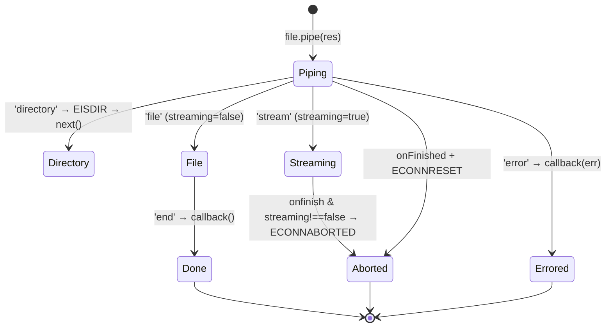

# 06 · The Response Object

> **What you'll be able to answer after this chapter**
> - Every `res` method: signature, overloads, side effects (headers/status), and return value. (Interfaces)
> - Exactly how `res.send` infers content type, sets `Content-Length`, generates ETags, and handles 204/205/304/HEAD. (Mechanism)
> - The security mitigations in `res.jsonp`, `res.redirect`, `res.location`, and `res.cookie`. (Security)
> - How `res.sendFile`/`res.download` stream files and handle aborts/errors. (Failure / Concurrency)

**Source of truth:** `lib/response.js` (1,051 lines), grounded by every `test/res.*.js`.
`res` is `Object.create(http.ServerResponse.prototype)` (`lib/response.js:43`); the prototype
is installed per request by `Object.setPrototypeOf(res, this.response)`
(`lib/application.js:170`). **Most methods return `this` for chaining**; the exceptions are
`res.redirect`, `res.sendFile`, and `res.download` (they don't return `this`).

---

## Method map

| Category | Methods |
|---|---|
| Status | `status`, `sendStatus` |
| Body | `send`, `json`, `jsonp`, `render` |
| Files | `sendFile`, `download`, `attachment` |
| Headers | `set`/`header`, `get`, `append`, `type`/`contentType`, `vary`, `links`, `location` |
| Cookies | `cookie`, `clearCookie` |
| Redirect | `redirect` |
| Negotiation | `format` |

## 1. `res.status(code)` and `res.sendStatus(code)`

```js
// lib/response.js:65-77
res.status = function status(code) {
  if (!Number.isInteger(code)) throw new TypeError(`Invalid status code: ${JSON.stringify(code)}. Status code must be an integer.`);
  if (code < 100 || code > 999) throw new RangeError(`Invalid status code: ${JSON.stringify(code)}. Status code must be greater than 99 and less than 1000.`);
  this.statusCode = code;
  return this;
};
```

- **Integer-only, range 100–999** (an Express 5 breaking change). Non-integers throw
  `TypeError`; out-of-range throw `RangeError`. Both surface as **500** (the router converts
  the throw). Grounded across `test/res.status.js`: `"200"`, `NaN`, `null`, `undefined`,
  `200.1`, `99`, `1000` all → 500 `/Invalid status code/`; oddball but in-range codes like
  `700`/`900` are accepted (`:20-192`).
- **`res.sendStatus(code)`** (`:323-330`): sets the status, sets `Content-Type: text/plain`,
  and sends the reason phrase as the body — `sendStatus(201)` → body `'Created'`; an unknown
  code → the number as a string, `sendStatus(599)` → `'599'` (`test/res.sendStatus.js`).
  `sendStatus(undefined)` → `res.status(undefined)` throws → 500.

## 2. `res.send(body)` — the central method

`res.send` is where most responses ultimately go (`res.json`, `res.jsonp`, `res.sendStatus`,
`res.render`'s default callback all call it). Signature accepts
`string | number | boolean | object | Buffer | ArrayBufferView` and returns `this`.

### Content-type inference (`switch typeof chunk`, `:134-159`)

```js
switch (typeof chunk) {
  case 'string':                          // → text/html; charset=utf-8 (unless CT already set)
    encoding = 'utf8';
    const type = this.get('Content-Type');
    if (typeof type === 'string') this.set('Content-Type', setCharset(type, 'utf-8'));
    else this.type('html');
    break;
  case 'boolean': case 'number': case 'object':
    if (chunk === null) chunk = '';
    else if (ArrayBuffer.isView(chunk)) { if (!this.get('Content-Type')) this.type('bin'); }  // Buffer/TypedArray → octet-stream
    else return this.json(chunk);         // ← plain objects/arrays/numbers/booleans go to JSON
    break;
}
```

So:
- **string** → `text/html; charset=utf-8` by default (`test/res.send.js:71-83`).
- **Buffer / TypedArray** → `application/octet-stream` unless a Content-Type is already set
  (`:165-218`; `Uint8Array` supported since 5.1.0).
- **number / boolean / array / plain object** → **delegated to `res.json`** →
  `application/json; charset=utf-8` (`:56-69` sends `'1000'` for `send(1000)`; `:234-247` an
  object).
- **`null`** → empty body with explicit `Content-Length: 0` (`:27-40`).

**Charset asymmetry (important):** charset is forced to utf-8 **only for string bodies**
(`:141` via `setCharset`). A pre-set `text/plain; charset=iso-8859-1` + `send('hey')` becomes
`text/plain; charset=utf-8`, while existing non-charset params are preserved
(`text/plain; foo=bar` → `text/plain; foo=bar; charset=utf-8`) and an unparseable Content-Type
does **not** throw (`test/res.send.js:112-149`). **Buffers keep their charset** because they
skip the string branch (`:151-162`).

### Content-Length ↔ Transfer-Encoding (`:167-183`)

```js
if (chunk !== undefined && !this.get('Transfer-Encoding')) {   // :168  (fix from commit 18e5985)
  if (Buffer.isBuffer(chunk))                 len = chunk.length;
  else if (!generateETag && chunk.length < 1000) len = Buffer.byteLength(chunk, encoding);  // fast path
  else { chunk = Buffer.from(chunk, encoding); encoding = undefined; len = chunk.length; }
  this.set('Content-Length', len);
}
```

- `Content-Length` is set **only when there's a body and no `Transfer-Encoding`** — the two
  headers are mutually exclusive per the HTTP spec (this is the most recent bug fix,
  `History.md` "Unreleased", commit `18e5985`). If `Transfer-Encoding` is present,
  `Content-Length` is omitted (`test/res.send.js:596-619`).
- `send(undefined)` / `send()` leave `chunk` undefined → **no Content-Length and no ETag**
  (`:14-24,42-54`).
- Small strings (<1000 bytes) with no ETag take a cheap `Buffer.byteLength` fast path instead
  of allocating a Buffer.

### ETag generation (`:162-163,185-191`)

```js
var etagFn = app.get('etag fn')
var generateETag = !this.get('ETag') && typeof etagFn === 'function'
...
if (generateETag && len !== undefined) { if ((etag = etagFn(chunk, encoding))) this.set('ETag', etag); }
```

- An ETag is generated only if none is already set and an `etag fn` exists (default `'weak'`).
  A 999-char string → `W/"3e7-…"` (weak); with `app.set('etag','strong')` → unquoted-prefix
  `"d-…"` (`test/res.send.js:85-97,521-553`). A manually-set ETag is **never overridden**
  (`:220-231`). `send()`/undefined → no ETag even when enabled (`:471-484`).

### Freshness → 304, and status-based header stripping (`:193-209`)

```js
if (req.fresh) this.status(304);                          // conditional GET hit
if (204 === this.statusCode || 304 === this.statusCode) { // strip body-related headers
  this.removeHeader('Content-Type'); this.removeHeader('Content-Length'); this.removeHeader('Transfer-Encoding'); chunk = '';
}
if (this.statusCode === 205) { this.set('Content-Length','0'); this.removeHeader('Transfer-Encoding'); chunk = ''; }
```

- If `req.fresh` is true (a valid conditional GET, [Chapter 5 §8](05-the-request-object.md#8-reqpath-reqfreshreqstale-reqxhr)), the status becomes **304**
  and the body is dropped (`test/res.send.js:315-344`). Not applied on non-2xx like 500
  (`:346-361`).
- **204/304** strip `Content-Type`, `Content-Length`, `Transfer-Encoding`. **205** is special:
  it keeps `Content-Type` but forces `Content-Length: 0` and drops `Transfer-Encoding`
  (`:282-313`).

### HEAD (`:211-217`)

```js
if (req.method === 'HEAD') this.end();     // headers only, no body
else this.end(chunk, encoding);
```

A HEAD request gets all the computed headers but no body (`test/res.send.js:249-263`). Note
`res.send` does **not** honor `?callback=` — JSONP is only via `res.jsonp` (`:363-373`).

## 3. `res.json(obj)` and `res.jsonp(obj)`

**`res.json`** (`:234-248`) serializes with the app's `json escape` / `json replacer` /
`json spaces` settings via the internal `stringify` helper (`:1026-1050`), sets
`Content-Type: application/json` only if none is set, then calls `res.send`. With
`json escape` enabled, `<`, `>`, `&` in the output are escaped to `<`, `>`,
`&` (`:1033-1047`) — an HTML-sniffing mitigation for embedding JSON in HTML
(`test/res.json.js:112-125`). A pre-set Content-Type (e.g. `application/vnd.example+json`) is
respected (`:21-33`).

**`res.jsonp`** (`:262-306`) is security-critical. It reads the callback name from
`req.query[app.get('jsonp callback name')]` (default `'callback'`):

```js
// lib/response.js:283-302 (callback present)
this.set('X-Content-Type-Options', 'nosniff');
this.set('Content-Type', 'text/javascript');
callback = callback.replace(/[^\[\]\w$.]/g, '');           // :288 sanitize callback identifier
if (body === undefined) body = '';
else if (typeof body === 'string') body = body.replace(/
/g,'\\u2028').replace(/
/g,'\\u2029'); // :295-298
body = '/**/ typeof ' + callback + ' === \'function\' && ' + callback + '(' + body + ');';  // :302
```

Three mitigations, all grounded (`test/res.jsonp.js`):
1. **Callback sanitization** — everything except word chars, `$`, `.`, `[`, `]` is stripped, so
   `?callback=foo;bar()` becomes `foobar` (`:77-88`). Prevents XSS via the callback name.
2. **`X-Content-Type-Options: nosniff`** + `Content-Type: text/javascript` — set for both the
   callback and no-callback branches (`:272-275,284-285`).
3. **Rosetta-Flash `/**/` prefix** (`:300-302`) — the leading `/**/` neutralizes a
   content-sniffing Flash attack; the `typeof … === 'function'` guard reduces client error
   noise. Body always starts with `/**/` (`:116-128`).
4. **Unicode line separators** `
`/`
` (valid in JSON, illegal in JS) are escaped
   (`:90-101`). (The no-callback JSON fallback does *not* escape them, `:103-114`.)

An array callback takes `callback[0]` (`:278-280`); a non-string/absent callback falls back to
plain JSON. **`nosniff` is still set** in that fallback — the `if (!this.get('Content-Type'))`
block at `:272-275` sets `X-Content-Type-Options: nosniff` + `application/json` for *every*
branch when no Content-Type is pre-set; `nosniff` is absent only when a Content-Type was already
set (`test/res.jsonp.js:130-143`).

## 4. Headers: `set`/`header`, `get`, `append`, `type`, `vary`, `links`, `location`

- **`res.set(field, val)` / `res.header`** (`:667-689`): two-arg form coerces `val` to string
  (arrays → `val.map(String)`). If `field` is `content-type`: an **array throws**
  `TypeError('Content-Type cannot be set to an Array')` (`:675-678`, → 500); otherwise
  `mime.contentType(value)` expands the charset. Object form iterates keys and recurses. `set`
  **replaces** any prior value for that header (`test/res.set.js`).
- **`res.get(field)`** (`:699-701`): thin wrapper over `getHeader` (case-insensitive).
- **`res.append(field, val)`** (`:632-644`): appends, building an array if a prior value
  exists — the standard way to emit multiple `Set-Cookie` or `Link` headers
  (`test/res.append.js`). Note a subsequent `res.set` **resets** what `append` accumulated.
- **`res.type(type)` / `res.contentType`** (`:505-512`): if `type` has no `/`, maps via
  `mime.contentType(type)` (unknown → `application/octet-stream`); else sets it verbatim.
  `res.type('json')` → `application/json; charset=utf-8`; `res.type('rawr')` → octet-stream
  (`test/res.type.js`).
- **`res.vary(field)`** (`:878-882`): delegates to the `vary` package; de-duplicates; throws
  `/field.*required/` (→ 500) if called with no argument (`test/res.vary.js:8-21`).
- **`res.links(links)`** (`:98-111`): builds/extends the `Link` header; an array value under a
  rel emits repeated `rel` entries (`test/res.links.js`).
- **`res.location(url)`** (`:797-799`): `this.set('Location', encodeUrl(url))`. `encodeUrl`
  percent-encodes unencoded characters **but preserves already-encoded sequences and URL
  structure** — a deliberate anti-bypass property: `http://google.com\@apple.com` keeps host
  `google.com`, CRLF stays encoded (`test/res.location.js:126-303`). **Gotcha:** the JSDoc
  still documents `"back"` support (`:783-785`), but the implementation has **no** `"back"`
  handling — `res.location('back')` literally emits `Location: back` (dead documentation, no
  test).

## 5. `res.redirect([status,] url)`

```js
// lib/response.js:815-867  (does NOT return this)
res.redirect = function redirect(url) {
  var status = 302, address = url;
  if (arguments.length === 2) { status = arguments[0]; address = arguments[1]; }   // (status, url)
  // depd deprecation warnings for missing/non-string url / non-number status (non-fatal)
  address = this.location(address).get('Location');    // encode, then read back
  this.format({                                        // negotiated body
    text: () => body = statuses.message[status] + '. Redirecting to ' + address,
    html: () => body = '<!DOCTYPE html><head><title>'+statuses.message[status]+'</title></head>'
                     + '<body><p>'+statuses.message[status]+'. Redirecting to '+escapeHtml(address)+'</p></body>',
    default: () => body = ''
  });
  this.status(status);
  this.set('Content-Length', Buffer.byteLength(body));
  this.req.method === 'HEAD' ? this.end() : this.end(body);
};
```

- Default status **302**; the two-arg form is `(status, url)` — the v4 `(url, status)` order
  was removed in v5 (`History.md`).
- **Double XSS protection**: the URL is `encodeUrl`-encoded in the `Location` header **and**
  `escapeHtml`-escaped in the HTML body — `<la'me>` → Location `%3Cla'me%3E`, body
  `%3Cla&#39;me%3E`; a `javascript:` link is neutralized (`test/res.redirect.js:97-129`).
- The body is content-negotiated via `res.format`, so it also sets `Vary: Accept`. If neither
  text nor html is accepted, the body is empty with `Content-Length: 0` and no Content-Type
  (`:195-213`).
- The `<!DOCTYPE html>`/`<title>`/`<body>` structure was added recently for browser
  compatibility (`History.md`, PR #5167).

## 6. Cookies: `res.cookie` and `res.clearCookie`

```js
// lib/response.js:745-778
res.cookie = function (name, value, options) {
  var opts = { ...options };                     // copy — never mutates caller's options
  var secret = this.req.secret; var signed = opts.signed;
  if (signed && !secret) throw new Error('cookieParser("secret") required for signed cookies');   // :750-752
  var val = typeof value === 'object' ? 'j:' + JSON.stringify(value) : String(value);             // object → j: prefix
  if (signed) val = 's:' + sign(val, secret);    // cookie-signature HMAC → s: prefix
  if (opts.maxAge != null) { var maxAge = opts.maxAge - 0; if (!isNaN(maxAge)) { opts.expires = new Date(Date.now()+maxAge); opts.maxAge = Math.floor(maxAge/1000); } }
  if (opts.path == null) opts.path = '/';
  this.append('Set-Cookie', cookie.serialize(name, String(val), opts));
  return this;
};
```

- **Signed cookies require a secret** (from `cookie-parser`); otherwise throws → 500
  (`test/res.cookie.js:262-276`). Object values are JSON-encoded with a `j:` prefix; signed
  values get an `s:` prefix.
- **`maxAge` (ms) → `expires`**: sets `expires = now + maxAge` and converts `maxAge` to seconds
  (`:762-769`). An invalid `maxAge` (NaN) skips conversion and then `cookie.serialize` throws
  `/option maxAge is invalid/` (`:174-185`). `path` defaults to `/`.
- Validation errors for `expires`/`maxAge`/`priority` originate in the `cookie` package and
  surface as 500.
- **`res.clearCookie(name, options)`** (`:712-719`): forces expiry with
  `{ path:'/', ...options, expires: new Date(1) }` and **deletes `maxAge`** — user-provided
  `expires`/`maxAge` are **always overridden** (an Express 5 behavior, `History.md` 5.0.0). It
  emits `<name>=; Path=/; Expires=Thu, 01 Jan 1970 00:00:00 GMT`.

## 7. `res.format(obj)` — content negotiation

```js
// lib/response.js:571-596
var keys = Object.keys(obj).filter(v => v !== 'default');
var key = keys.length > 0 ? req.accepts(keys) : false;
this.vary('Accept');                                        // always
if (key)          { this.set('Content-Type', normalizeType(key).value); obj[key](req, this, next); }
else if (obj.default) obj.default(req, this, next);
else next(createError(406, { types: normalizeTypes(keys).map(o => o.value) }));
```

- Negotiates against the `Accept` header; picks the best matching handler, sets the
  Content-Type for you, always adds `Vary: Accept`.
- **No match, no `default`** → passes a **406** error to `next` (with `err.types` listing the
  offered types, `test/res.format.js:239-247`).
- **Receiver subtlety:** handlers are invoked as `obj[key](req, res, next)`, so inside them
  `this === obj` (not `res`); the response is the second argument. A `default` can therefore
  call `this.json()` to reuse another formatter (`test/res.format.js:131-151`). Keys may be
  full MIME types or extension names (`normalizeType` canonicalizes).

## 8. `res.render(view, options?, callback?)`

```js
// lib/response.js:897-921  (async)
var app = this.req.app; var opts = options || {};
if (typeof options === 'function') { done = options; opts = {}; }
opts._locals = self.locals;                                 // res.locals → _locals
done = done || function (err, str) { if (err) return req.next(err); self.send(str); };  // default: send or next(err)
app.render(view, opts, done);
```

- Merges `res.locals` into `opts._locals`, then delegates to `app.render`
  ([Chapter 7](07-views-and-rendering.md)).
- **Default callback** auto-responds: on success `self.send(str)` (200, `text/html`); on error
  `req.next(err)`. Passing an explicit callback **suppresses** the auto-response — you own the
  reply (`test/res.render.js:300-357`).
- **Locals precedence:** render-call locals > `res.locals` > `app.locals`
  (`test/res.render.js:251-297`).

## 9. Files: `res.sendFile`, `res.download`, `res.attachment`

**`res.sendFile(path, options?, callback?)`** (`:373-415`, does not return `this`):
- Validates: falsy path → `TypeError('path argument is required')`; non-string → `TypeError`;
  a **relative path without `opts.root` → `TypeError('path must be absolute or specify root')`**
  (`:380-396`). This is a safety requirement.
- `pathname = encodeURI(path)` (allows special chars); wires `opts.etag = app.enabled('etag')`;
  creates a `send(req, pathname, opts)` stream and pipes it via the internal `sendfile()`.
- **Terminal callback** (`:406-414`): if you passed `done`, it's called; else `EISDIR` (a
  directory) → `next()` (fall through to 404); write errors and `ECONNABORTED` (client abort)
  are swallowed; other errors → `next(err)`.

The **`sendfile()` stream state machine** (`:924-1012`) coordinates the `send` stream's events
with a single `done` guard to prevent double-callback across abort/error/finish races:



Grounded (`test/res.sendFile.js`): directory → 404 (via EISDIR→next); not-found → 404;
default `Cache-Control: public, max-age=0`; **dotfiles are ignored by default → 404**
(`dotfiles:'ignore'`, `:125-131`), not 403 — `dotfiles:'deny'` (403) is opt-in (`:473-485`);
client abort → `ECONNABORTED` to the callback with no crash; `root` with `..` traversal →
**403**; ETag support and 304 on `If-None-Match`; options pass through to `send` (`start`/`end`,
`acceptRanges` → 206, `maxAge`, `immutable`, `lastModified`, `headers` set only on success).

**`res.download(path, filename?, options?, callback?)`** (`:435-484`): sets
`Content-Disposition: attachment; filename=…` (via `content-disposition`), **overriding** any
user-provided `content-disposition` header (case-insensitively), resolves the path (against cwd
unless `opts.root` is set), then delegates to `res.sendFile`. On failure the callback gets
`err.status = 404`, `err.code = 'ENOENT'`, and the `Content-Disposition` is not emitted
(`test/res.download.js`).

**`res.attachment(filename?)`** (`:606-615`): sets `Content-Disposition: attachment` and, if a
filename is given, also sets the Content-Type from its extension (`test/res.attachment.js`).
Note: since `content-disposition@2` (5.x), filenames that are valid HTTP tokens are no longer
quoted — `res.attachment('user.html')` → `attachment; filename=user.html` (`History.md`).

## 10. Security, concurrency & gotchas

- **Attacker-influenced inputs each have a sanitizer:** JSONP callback (`replace` + `nosniff`
  + `/**/`), `json escape` (HTML-sniffing), `redirect`/`location` (encodeUrl + escapeHtml,
  anti-bypass), `sendFile`/`download` root traversal (403 via `send`), signed cookies (secret
  required).
- **Concurrency:** `render`/`sendFile`/`download` are async; `sendfile`'s `done` flag is the
  sole idempotency guard against double-callback across abort/error/finish. Everything else is
  synchronous.
- **Gotchas:**
  - `res.send(object)` silently reroutes to `res.json` — booleans/numbers/arrays become JSON,
    not text.
  - Charset is forced to utf-8 for **strings** but preserved for **Buffers**.
  - `res.set('Content-Type', [array])` throws; other headers accept arrays.
  - `clearCookie` ignores user `expires`/`maxAge` unconditionally.
  - `res.location('back')` is silently unsupported despite the JSDoc.
  - **205** keeps Content-Type but forces `Content-Length: 0`; **204/304** strip Content-Type.
  - `res.redirect`, `res.sendFile`, `res.download` do **not** return `this`.

## 11. Traced example: `res.send('<p>hi</p>')`

```
res.send('<p>hi</p>')
  typeof chunk === 'string' → encoding='utf8'; no CT set → this.type('html')  ⇒ Content-Type: text/html; charset=utf-8
  generateETag = !ETag && etagFn(weak) exists → true
  chunk !== undefined && no Transfer-Encoding:
     small (<1000) but generateETag true → Buffer.from('<p>hi</p>') → len=9 → Content-Length: 9
  ETag: etagFn(chunk) → W/"9-<hash>"  ⇒ ETag header
  req.fresh? (no If-None-Match) → false
  status not 204/205/304; method GET → this.end(<buffer>, undefined)
```
Response: `200 OK`, `Content-Type: text/html; charset=utf-8`, `Content-Length: 9`,
`ETag: W/"9-…"`, body `<p>hi</p>`.

If the client resends with `If-None-Match: W/"9-…"`, `req.fresh` is true → `res.send` sets
**304**, strips `Content-Type`/`Content-Length`, and ends with no body.

## Where to look

- `lib/response.js` — all methods (line refs throughout).
- `lib/utils.js:225-238` (`setCharset`), `:61-77` (`normalizeType`/`normalizeTypes`),
  `:1026-1050` in response.js (`stringify`).
- `test/res.*.js` — the executable contract for every method.

## Open questions

- Exact behavior of external `mime.contentType`, `content-type.parse`, `cookie.serialize`
  validation, and `send`'s 403/404/range logic is treated as spec-by-test (deps absent from
  this checkout); the precise ETag hashes and cookie signatures are pinned to the dependency
  versions in `package.json`.

**Next:** [07 · Views & Rendering](07-views-and-rendering.md).
