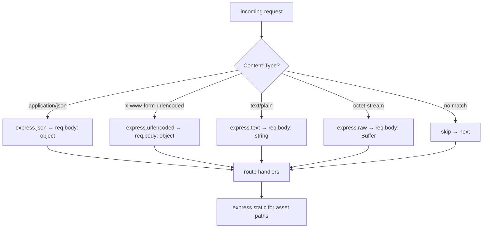

# 08 · Bundled Middleware (Body Parsers & Static)

> **What you'll be able to answer after this chapter**
> - What do `express.json/urlencoded/text/raw/static` do, and where does their code actually live? (Architecture)
> - Every option, its default, and its effect — for each parser and for the static server. (Interfaces / Config)
> - What error each middleware produces on bad input (400/413/415/403/…). (Failure)
> - The security posture: prototype pollution, path traversal, dotfiles, limits. (Security)

**The boundary:** These five middleware are **re-exported verbatim** — there is no parsing or
file-serving logic in this repo:

```js
// lib/express.js:77-81
exports.json        = bodyParser.json          // from body-parser
exports.raw         = bodyParser.raw
exports.static      = require('serve-static')
exports.text        = bodyParser.text
exports.urlencoded  = bodyParser.urlencoded
```

So `express.json` **is** `require('body-parser').json`, and `express.static` **is**
`require('serve-static')`. Their implementations live in those packages (absent from this
checkout). But the repo's `test/express.json.js`, `test/express.urlencoded.js`,
`test/express.text.js`, `test/express.raw.js`, and `test/express.static.js` are thorough
integration specs that pin the observable **contract** — every option, default, and error
below is grounded in those tests.

All four body parsers share a common architecture (they're built on the same `body-parser`
core): they inspect the request's `Content-Type` against a `type` option, read and optionally
decompress the body under a `limit`, run an optional `verify` hook, decode the charset, parse,
and assign the result to `req.body`. They **skip** (call `next()` without setting/parsing)
when there is no body or the content type doesn't match.

> **`req.body` initialization (an Express 5 change).** In v5, `req.body` is **no longer always
> initialized to `{}`** (`History.md`, 5.0.0-beta.1). The distinction is:
> - **Parser runs, body empty** (matching content-type, `Content-Length: 0` / empty chunked /
>   no message-body) → `req.body` is set to the empty value: `{}` for json/urlencoded, `""` for
>   text, an empty Buffer for raw (`test/express.json.js:19-41`).
> - **Parser skips** (content-type doesn't match, or no body detected) → `req.body` is **left
>   untouched (undefined)** unless something else set it — e.g. a custom-`type` json parser on a
>   standard `application/json` request returns `res.json(req.body)` → `''`, proving `req.body`
>   is `undefined`, not `{}` (`test/express.json.js:311-317`).
>
> So downstream code must not assume `req.body` exists — guard with `req.body?.x` or register the
> parser unconditionally for the routes that need it.

---

## 1. `express.json([options])`

Populates `req.body` with the parsed JSON. On an **empty body with a matching content-type**,
`req.body` is `{}`; on a **skip**, it's left undefined (see the note above,
`test/express.json.js:19-41,306-318`).

| Option | Default | Effect | Grounded |
|---|---|---|---|
| `limit` | `'100kb'` | Max body size (bytes number or string like `'1kb'`). Over → **413** `[entity.too.large]`. Enforced on raw, chunked, **and inflated** size. | `:121-194,709-718` |
| `inflate` | `true` | Decode gzip/deflate. `false` → **415** `[encoding.unsupported]` on any `Content-Encoding`. | `:196-224` |
| `strict` | `true` | Only accept objects/arrays. Strict rejects JSON primitives (`true`, `42`) → **400** `[entity.parse.failed]`. Leading whitespace before a primitive is still rejected; before `{`/`[` it's allowed. | `:226-295` |
| `type` | `'application/json'` | Which requests to parse: a MIME string, an array, or a `type(req)` predicate. A custom type makes `application/json` fall through unparsed. The function is **not called when there's no body**. | `:297-391` |
| `verify` | (none) | `verify(req, res, buf, encoding)` run before parsing; throwing → **403** `[entity.verify.failed]`. Non-function → `TypeError` at construction. | `:393-501` |
| `reviver` | (none) | Passed to `JSON.parse`. (Not exercised by in-repo tests.) | — |

> **Grounding caveat on defaults.** The default **`limit: '100kb'`** (all four parsers) and
> **`parameterLimit: 1000`** (urlencoded) are the real `body-parser` defaults, but they are **not
> pinned by any in-repo test** — the tests always pass *explicit* limits (e.g.
> `test/express.json.js:166` uses `'100kb'` only as an alternate value in a "options snapshot"
> test; `parameterLimit` is exercised only at `0`/`'beep'`/`10`/`10.1`/`5000`/`Infinity`,
> `test/express.urlencoded.js:316-426`). Treat these two numbers as documented-in-`body-parser`,
> not repo-verified. By contrast, `strict:true`, `extended:false`, and the static defaults below
> *are* pinned by tests.

**Charset & encoding:** default utf-8; parses utf-8 and utf-16; unknown charset → **415**
`[charset.unsupported]` (`:641`); identity/gzip/deflate supported (case-insensitive); unknown
encoding → **415**; malformed gzip → **400** (`:649-719`). Charset validation runs **before**
`verify` (`:489-500`).

**Error taxonomy** (message format `[err.type] err.message`, errors carry `.status`, `.type`,
`.body`, `.stack`):
- **400** invalid JSON / whitespace-only body / bad token / incomplete; also invalid or
  mismatched `Content-Length` (`/content length/`).
- **413** body exceeds `limit`.
- **415** unsupported charset or encoding.
- **403** `verify` threw.

## 2. `express.urlencoded([options])`

Populates `req.body` with parsed form data (`application/x-www-form-urlencoded`). Repeated
keys become arrays: `user=Tobi&user=Loki` → `{ user: ['Tobi','Loki'] }`
(`test/express.urlencoded.js:101-107`). Empty body with a matching content-type → `{}`; a skip
leaves `req.body` undefined (see the initialization note in §1).

| Option | Default | Effect | Grounded |
|---|---|---|---|
| `extended` | `false` | `false` → `node:querystring` (flat keys only; `user[name][first]=Tobi` stays a literal key). `true` → `qs` with bracket nesting, arrays, depth-32 objects, 500-element arrays. | `:87-209` |
| `limit` | `'100kb'` | Same size semantics as json (bytes/string, chunked, inflated → 413). | `:241-314` |
| `parameterLimit` | `1000` | Max number of parameters. Over → **413** `[parameters.too.many]`. Must be a positive number, else `TypeError`. Float compares by floor. | `:316-426` |
| `type` | `'application/x-www-form-urlencoded'` | String/array/predicate, like json; predicate not called without a body. | `:428-522` |
| `inflate` | `true` | `false` → 415. | `:211-239` |
| `verify` | (none) | Same contract as json (403 on throw; TypeError if non-function). | `:524-604` |

**Gotcha:** the default `extended:false` (an Express 5 change) means bracket syntax does
**not** nest — a frequent surprise (`:79-99`). Enable `extended:true` for nested forms;
that uses `qs`, which has the `allowPrototypes` consideration (see [Chapter 9](09-cross-cutting-concerns.md)).

## 3. `express.text([options])` and `express.raw([options])`

**`express.text`** sets `req.body` to a **string** (`test/express.text.js` app does
`res.json(req.body)` → `'"user is tobi"'`). Empty body with a matching content-type → `""`; a
skip leaves `req.body` undefined (§1 note).

| Option | Default | Effect |
|---|---|---|
| `defaultCharset` | `'utf-8'` | Charset when the request omits one; an explicit `charset=` in the Content-Type overrides it (`:77-93`). |
| `type` | `'text/plain'` | String/array/predicate. |
| `limit` / `inflate` / `verify` | `'100kb'` / `true` / none | Same semantics as json. |

Parses arbitrary code pages (`koi8-r` → `"name is нет"`); unknown charset → **415**
(`test/express.text.js:453-493`).

**`express.raw`** sets `req.body` to a **Buffer** (`Buffer.isBuffer(req.body)` is true). Empty
body with a matching content-type → an empty Buffer; a skip leaves `req.body` undefined (§1 note).

| Option | Default | Effect |
|---|---|---|
| `type` | `'application/octet-stream'` | String/array/predicate. |
| `limit` / `inflate` / `verify` | `'100kb'` / `true` / none | Same semantics. |

**Distinctive:** `express.raw` **ignores charset entirely** — `application/octet-stream;
charset=utf-8` returns raw bytes and does **not** 415 (`test/express.raw.js:425-435`).

## 4. Behaviors common to all four parsers

- **Options are snapshotted at construction** — mutating the options object after
  `express.json(opts)` has no effect (`test/express.json.js:161-173`).
- **Duplicate parser middleware is idempotent** — `app.use(express.json()); app.use(express.json())`
  parses once; the second run short-circuits because `req.body` is already set (inferred from
  test intent, `:73-88`).
- **Body-presence check precedes the `type` predicate** — a `type` function is never invoked
  for a bodyless request (a GET with no body 404s before the predicate runs, `:379-389`).
- **AsyncLocalStorage context survives the parse** — a hard invariant the tests protect across
  success, skip, inflate, and every error path (`:503-605` and equivalents in the other three
  parser tests). This matters for request-scoped context propagation (tracing, per-request
  stores) across the parser's async work.
- **Invalid/mismatched `Content-Length` → 400** for all four (`/content length/`).
- **Charset validation precedes `verify`** (415 wins over 403).

## 5. `express.static(root, [options])`

Serves files from `root`. It's `serve-static` (which wraps `send`). The test factory mounts
it followed by a 404 fallthrough handler (`test/express.static.js:804-815`).

**Root validation:** `express.static()` with no root throws `/root path required/`; a
non-string root throws `/root path.*string/` (`:22-28`).

**Default behavior** (`:30-135`):
- Serves files with correct `Content-Type` (e.g. `text/plain; charset=utf-8`), `Last-Modified`,
  and default `Cache-Control: public, max-age=0`.
- Handles URL-encoded pathnames, resolves `../` **within** root, serves `index.html` for a
  directory requested with a trailing slash, returns no body for HEAD, **skips** (→ next, 404)
  for non-GET/HEAD methods, serves zero-length files, and **hides dotfiles** (`.name` → 404).

**Conditional & range requests:**
- `If-None-Match: <etag>` → **304**; `If-Match: "foo"` (mismatch) → **412** (`:103-122`).
- Range: `bytes=0-4` → `'12345'` with **206** and `Content-Range: bytes 0-4/9`; suffix `-3`,
  open `3-`, clamping past EOF, `bytes */9` → **416** when start is beyond length; a
  syntactically invalid `Range` → **200** full content (`:593-690`).

| Option | Default | Effect | Grounded |
|---|---|---|---|
| `index` | `'index.html'` | Directory index file(s). `false` → no index (dir-with-slash → next/404). | `:767-801` |
| `dotfiles` | `'ignore'` | `'ignore'` (404), `'allow'` (serve), `'deny'` (403). (Default changed to `'ignore'` in v5, `History.md`.) | `:404-416` |
| `etag` | `true` | Emit ETag / support conditional GET. | `:103-115` |
| `lastModified` | `true` | Emit `Last-Modified`; `false` removes it. | `:432-450` |
| `cacheControl` | `true` | `false` removes `Cache-Control` and ignores `maxAge`. | `:188-213` |
| `maxAge` | `0` | Cache max-age; string `'30d'` → `2592000`; `Infinity` clamps to 1 year. | `:452-466` |
| `immutable` | `false` | Adds `immutable` to `Cache-Control` (needs a non-zero `maxAge`). | `:418-430` |
| `acceptRanges` | `true` | `false` removes `Accept-Ranges` and ignores `Range` (returns full 200). | `:150-186` |
| `redirect` | `true` | Directory without trailing slash → **301** to `…/` (with `Content-Security-Policy: default-src 'none'`), query preserved, special chars encoded. `false` → 404. | `:291-325,468-539` |
| `extensions` | `false` | Try these extensions for extensionless URLs; array picks first match. | `:215-245` |
| `fallthrough` | `true` | See below. | `:247-402` |
| `setHeaders` | (none) | `fn(res, path, stat)` to set custom headers on send. Non-function throws. Not called on 404 or redirect. | `:541-573` |

### `fallthrough` — the key control-flow switch

- **`true` (default):** non-matching conditions call `next()` (→ your 404). OPTIONS,
  malformed URL (`/%`), traversal-past-root, and `ENAMETOOLONG` all **silently 404**
  (`:248-289`).
- **`false`:** errors surface as real responses — OPTIONS → **405** with `Allow: GET, HEAD`;
  `/%` → **400** `BadRequestError`; traversal-past-root → **403** `ForbiddenError`;
  overly-long path → **404** `ENAMETOOLONG` (`:333-364`).

### Static security

- **Path traversal blocked:** URL-encoded `../` (`%2e%2e`) → **403**; root-disclosure attempts
  (`/users/../../fixtures/todo.txt`) → **403** (`:580-590`; `test/acceptance/downloads.js:40-46`
  confirms `/files/../index.js` → 403).
- **Dotfiles hidden by default** (`'ignore'`), so `.env`-style files aren't served unless you
  opt in with `dotfiles: 'allow'`.
- **`Infinity` maxAge is clamped to 1 year**, not literally infinite.

### Mounting recipes (examples)

```js
app.use(express.static(path.join(__dirname, 'public')));       // serve a dir at root
app.use('/static', express.static(path.join(__dirname, 'public')));  // under a prefix (strips /static)
app.use(express.static(dirA));  app.use(express.static(dirB));        // stacked dirs, first hit wins
```
(`examples/static-files/index.js:22-36`.) When mounted under a prefix, a directory redirect is
relative to `req.originalUrl` → `Location: /static/users/`
(`test/express.static.js:706-718`).

## 6. Choosing and ordering middleware



Order matters: register body parsers **before** the routes that read `req.body`, and register
`express.static` where you want it in the stack (usually early, so assets short-circuit before
dynamic routes; or after, so dynamic routes win). Each parser only acts on its content type, so
stacking `express.json()` and `express.urlencoded()` is safe and common.

## 7. Traced example: a JSON POST

```js
app.use(express.json({ limit: '10kb' }));
app.post('/echo', (req, res) => res.json(req.body));
// POST /echo  Content-Type: application/json  body: {"name":"tj"}
```

1. `express.json` middleware runs. Content-Type matches `application/json` and there's a body,
   so it doesn't skip.
2. It reads the body under the 10kb limit (413 if exceeded), verifies charset (utf-8), parses
   `{"name":"tj"}` in strict mode (starts with `{` → OK), assigns `req.body = { name: 'tj' }`,
   calls `next()`.
3. The route handler runs: `res.json(req.body)` → `Content-Type: application/json;
   charset=utf-8`, body `{"name":"tj"}`.

Failure branches: body `true` → **400** (strict rejects primitives); body over 10kb → **413**;
`Content-Type: application/json; charset=KOI8-R` → **415**; a malformed `{"name":` → **400**
`[entity.parse.failed]`.

## Where to look

- `lib/express.js:77-81` — the re-export surface (the only in-repo code).
- `test/express.json.js`, `test/express.urlencoded.js`, `test/express.text.js`,
  `test/express.raw.js`, `test/express.static.js` — the full contract, option by option.
- `examples/static-files`, `examples/downloads`, `examples/web-service`, `examples/mvc` —
  real usage.

## Open questions

- The `reviver` option (json) and the exact short-circuit mechanism for duplicate parsers live
  in `body-parser` (not in repo) — inferred from test behavior. Precise 4xx/5xx precedence when
  *both* a bad Content-Length and an unsupported charset are present is untested.
- `serve-static`/`send` internals (the exact range/conditional/traversal logic) are external;
  behavior is pinned by `test/express.static.js`.

**Next:** [09 · Cross-Cutting Concerns](09-cross-cutting-concerns.md).
