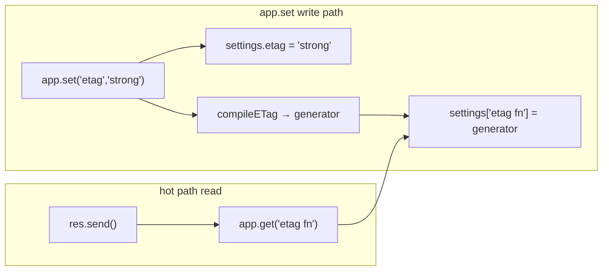
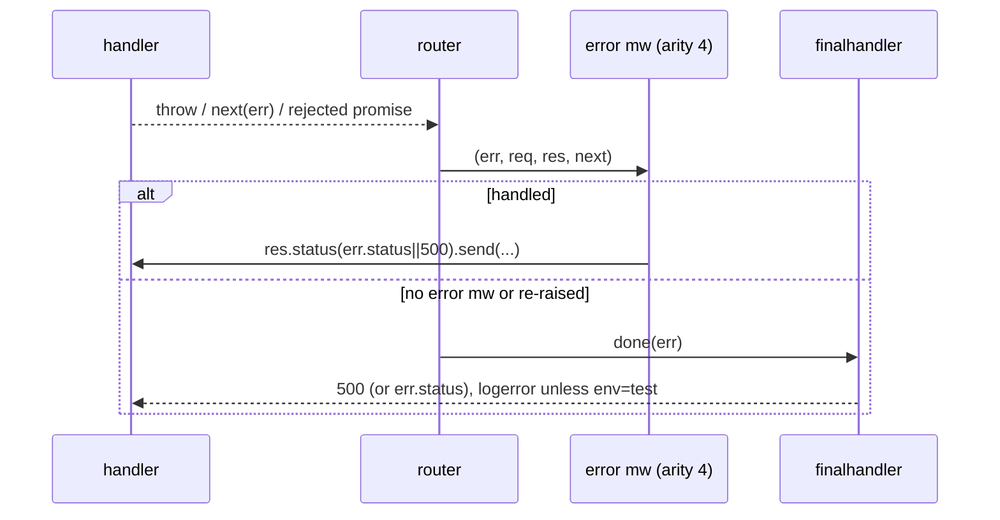

# 09 · Cross-Cutting Concerns

> **What you'll be able to answer after this chapter**
> - How the utility helpers (ETag, query-parser, trust-proxy compilers; content-type normalization) work. (Mechanism)
> - How configuration/settings behave as a system, and how they're compiled and inherited. (State)
> - How errors are handled and propagated everywhere; the default handler. (Failure)
> - The security posture, logging, and the full dependency map. (Security / Operations)

This chapter covers the concerns that thread through every other chapter: `lib/utils.js`, the
settings system, error handling, security, logging, and dependencies.

---

## 1. `lib/utils.js` — the shared helpers

`lib/utils.js` (271 lines) holds Express's only pure, private helpers. All are marked
`@api private` and grounded by `test/utils.js`.

### The HTTP method list (`:29`)

```js
exports.methods = require('node:http').METHODS.map((method) => method.toLowerCase());
```

The lowercased list of HTTP methods **Node supports** — used to generate `app.get/post/...`
(`lib/application.js:471`) and by `app.all` (`:498`). In Express 5 this derives from
`node:http` directly (the standalone `methods` package was removed, `History.md` 5.1.0), so the
verb set tracks the Node runtime — it includes `connect`, `query`, etc.

### ETag generators (`:40-51,249-257`)

```js
exports.etag  = createETagGenerator({ weak: false })   // strong
exports.wetag = createETagGenerator({ weak: true })    // weak (W/ prefix)
function createETagGenerator (options) {
  return function generateETag (body, encoding) {
    var buf = !Buffer.isBuffer(body) ? Buffer.from(body, encoding) : body
    return etag(buf, options)   // the `etag` package
  }
}
```

Strong vs. weak ETags over a body/encoding. `'express!'` → `"8-O2uVAFaQ1rZvlKLT14RnuvjPIdg"`
(strong), `W/"…"` (weak) (`test/utils.js:9-90`). These back the `etag`/`etag fn` setting and
`res.send`'s ETag generation ([Chapter 6](06-the-response-object.md#3-resjsonobj-and-resjsonpobj)).

### Content-type helpers (`:61-120,225-238`)

- **`normalizeType(type)`** (`:61-65`): `'html'` → `{ value: 'text/html', params: {} }`; a
  string containing `/` is parsed for params via `acceptParams`; an unknown extension →
  `application/octet-stream`. Used by `res.format` and `res.type`.
- **`acceptParams(str)`** (`:89-120`): parses `type;q=…;key=…` into `{ value, quality, params }`.
  A `q=` param sets `.quality` (via `parseFloat`); a malformed param (no `=`) breaks the loop
  gracefully (`test/utils.js:30-37`). This is the loop that 5.1.0's perf note optimized
  (`History.md`).
- **`setCharset(type, charset)`** (`:225-238`): parses a Content-Type with the `content-type`
  package, sets `parameters.charset`, and reformats — returning the original unchanged if either
  argument is falsy. This is what `res.send` uses to force utf-8 on string bodies while
  preserving existing params (`test/utils.js:49-67`).

### The setting compilers (`:130-214`)

These turn a config value into a fast function once, at set time (called from
`app.set`, `lib/application.js:363-380`):

| Compiler | Input → output | Throws on |
|---|---|---|
| `compileETag(val)` (`:130-152`) | fn → as-is; `true`/`'weak'` → `wetag`; `'strong'` → `etag`; `false` → `undefined` | any other value: `TypeError: unknown value for etag function: …` |
| `compileQueryParser(val)` (`:162-184`) | fn → as-is; `true`/`'simple'` → `querystring.parse`; `'extended'` → `qs.parse(…allowPrototypes)`; `false` → `undefined` | any other value: `TypeError: unknown value for query parser function: …` |
| `compileTrust(val)` (`:194-214`) | fn → as-is; `true` → `()=>true`; number `N` → `(a,i)=>i<N`; string → comma-split+`proxyaddr.compile`; else `proxyaddr.compile(val||[])` | (does not throw; unknown types fall through to `proxyaddr.compile`) |

The throwing behavior of the first two is a deliberate **fail-fast at configuration time**
rather than at request time (`test/utils.js:107-114`, `test/config.js:41-45`).

## 2. Configuration as a system

Settings are the primary way behavior is tuned. The mechanics (detailed in
[Chapter 3](03-the-application-object.md#4-the-settings-api)):

- **Storage:** `app.settings`, a null-prototype object (`lib/application.js:64`) — so
  arbitrary names (even `hasOwnProperty`) are safe and there's no prototype-pollution surface.
- **API:** `set`/`get`/`enable`/`disable`/`enabled`/`disabled`. `app.get(name)` with one arg is
  a getter; `app.get(path, handler)` registers a route (the arity overload).
- **Compilation:** `etag`/`query parser`/`trust proxy` compile companion `… fn` keys on write.
- **Inheritance:** on mount, a child app's `settings` object is prototype-linked to the parent's
  (`lib/application.js:121`), so children read parent settings unless they shadow them; the
  trust-proxy symbol governs a back-compat inheritance nuance
  ([Chapter 3 §6](03-the-application-object.md#the-trust-proxy-inheritance-dance)).



The full settings catalog is in
[Chapter 3](03-the-application-object.md#the-complete-settings-catalog).

## 3. Error handling everywhere

Express has one unified error model: **errors flow to error-handling (arity-4) middleware, and
whatever isn't handled reaches `finalhandler`.**

### How errors enter the pipeline

- A handler **throws** → the router catches it → `next(err)` ([Chapter 4](04-routing-and-middleware.md#errors-are-caught-and-converted-to-nexterr)).
- A handler **returns a rejected Promise** → `next(err)` (rejection with no value →
  `Error('Rejected promise')`).
- A handler explicitly calls **`next(err)`**.
- Express's own methods throw typed errors: `res.status` (`RangeError`/`TypeError`), `req.get`
  (`TypeError`), `res.set('Content-Type', [])` (`TypeError`), `res.cookie` (secret required),
  `res.vary()` (field required), body parsers (400/413/415/403), `res.format` (406 via
  `http-errors`).

### How errors are dispatched

While an error is "in flight," the router runs only arity-4 middleware `(err, req, res, next)`
and skips ordinary middleware (`test/app.routes.error.js:25-60`). An error handler can respond,
re-raise with `next(err)`, or resolve with `next()` (returning to the normal flow).

### The default handler: `finalhandler`

`app.handle` installs `finalhandler` as the end-of-stack `done` callback (`lib/application.js:154-157`):

```js
var done = callback || finalhandler(req, res, { env: this.get('env'), onerror: logerror.bind(this) });
```

- **No response, no error** (stack exhausted) → **404**.
- **Unhandled error** → **500** (or the error's `.status`/`.statusCode` if set).
- **Logging:** `finalhandler` calls the `onerror` hook = `logerror`, which does
  `console.error(err)` **unless `env === 'test'`** (`lib/application.js:615-618`). Since 5.x the
  handler logs the **full error object** (not just the stack), so `Error.cause` and
  library-specific fields survive (`History.md`, PR #6464).
- **`env`** feeds `finalhandler`'s environment: in development it may include the stack in the
  response body; in production it doesn't (behavior of `finalhandler`, keyed off the `env`
  setting).

### The `err.status`/`err.statusCode` convention

Express and its middleware set `.status` on errors so handlers can map them to responses. The
examples codify the idiom `res.status(err.status || 500)` (`examples/error/index.js`,
`examples/web-service/index.js:98-103`), and use `http-errors`' `createError(status, msg)` to
build typed errors (`examples/params/index.js:27`). `res.format` builds a 406 with
`err.types` (`lib/response.js:590-592`).



## 4. Security posture (consolidated)

Express's security-relevant behaviors, gathered from across the code:

| Concern | Mechanism | Where |
|---|---|---|
| **Proxy header spoofing** | `trust proxy` default `false` → ignore all `X-Forwarded-*`. Configure explicitly to trust. | `lib/application.js:99`, `lib/request.js` |
| **Prototype pollution (query)** | Default `query parser` `'simple'` (safe); disabled → null-proto object; `'extended'` opts into `allowPrototypes:true` (footgun on untrusted input). | `lib/utils.js:162-184,269` |
| **Prototype pollution (settings/locals)** | Null-prototype `settings`/`locals`/`engines`/`cache`. | `lib/application.js:62-64,125` |
| **JSONP injection / Rosetta Flash** | Callback sanitized to `[\]\w$.]`; `nosniff`; `/**/` prefix; unicode line-sep escaping. | `lib/response.js:283-302` |
| **JSON-in-HTML sniffing** | `json escape` escapes `<`,`>`,`&`. | `lib/response.js:1033-1047` |
| **Open redirect / XSS in redirect** | `encodeUrl` on `Location` (anti-bypass) + `escapeHtml` on HTML body. | `lib/response.js:797-799,839-851` |
| **Path traversal (static/sendFile)** | `send`/`serve-static` reject `..` past root. For `express.static` the visible status depends on `fallthrough`: default `fallthrough:true` → **404**; `fallthrough:false` → **403** `ForbiddenError`. `res.sendFile` with `root` → **403**; and it requires an absolute path or `root`. | `lib/response.js:394-396`, `test/express.static.js:575-590` |
| **Dotfile exposure** | `serve-static` default `dotfiles:'ignore'`. | `test/express.static.js:130-134` |
| **Signed cookies** | HMAC via `cookie-signature`; secret required or throws. | `lib/response.js:750-760` |
| **Body-size DoS** | Body parsers enforce `limit` (raw, chunked, inflated) and `parameterLimit`. | `test/express.json.js`, `test/express.urlencoded.js` |
| **Information leak** | `X-Powered-By: Express` is **on by default** — `app.disable('x-powered-by')` to hide. | `lib/application.js:94,160-162` |

> **Extended-query-parser CVE saga (5.2.0 → 5.2.1).** The most recent security-history fact about
> the exact subsystem flagged above (`'extended'` / `allowPrototypes`): version **5.2.0** shipped a
> "security fix for CVE-2024-51999" that made a breaking change to the extended query parser;
> **5.2.1** (this checkout) **fully reverted it** because the CVE was **rejected** — "There is no
> actual security vulnerability associated with this behavior" (`History.md:44-52`). So in 5.2.1
> the extended parser behaves as it did in 5.1.x. The standing guidance is unchanged: prefer the
> default `'simple'` parser, and only enable `'extended'` on trusted input.

**Trust boundary summary:** every attacker-influenced input — forwarded headers, query string,
JSONP callback, redirect target, cookie values, file paths, request body — has a corresponding
default-safe behavior or sanitizer. The two defaults you may want to change for hardening are
enabling `trust proxy` (only behind a real proxy) and disabling `x-powered-by`.

## 5. Logging & debugging

Express uses the `debug` package with namespaced loggers:
- `express:application` (`lib/application.js:17`) — logs boot mode and `app.set` calls.
- `express:view` (`lib/view.js:16`) — logs engine requires, lookups, and stats.

Enable with the `DEBUG` env var, e.g. `DEBUG=express:* node app.js`. This is the primary
built-in observability hook. Bundled middleware (`body-parser`, `send`, `serve-static`) have
their own `debug` namespaces.

## 6. The dependency map (and why each exists)

Express is deliberately a thin composition of focused packages. The complete runtime dependency
list from `package.json`, grouped by concern:

| Concern | Packages |
|---|---|
| **Routing** | `router` |
| **Body parsing / static** | `body-parser`, `serve-static`, `send` |
| **Dispatch tail** | `finalhandler`, `once` |
| **Content negotiation** | `accepts`, `type-is`, `mime-types`, `content-type` |
| **Proxy / addressing** | `proxy-addr`, `parseurl` |
| **Caching / conditional** | `etag`, `fresh`, `range-parser` |
| **Query parsing** | `qs` (+ Node's `querystring`) |
| **Cookies** | `cookie`, `cookie-signature` |
| **Headers / URLs** | `content-disposition`, `encodeurl`, `escape-html`, `vary`, `statuses`, `http-errors` |
| **Lifecycle** | `on-finished` |
| **Framework glue** | `merge-descriptors`, `depd`, `debug` |

The v5 line **removed** several deps in favor of native APIs: `setprototypeof`
(`Object.setPrototypeOf`), `safe-buffer` (`node:buffer`), `utils-merge` (spread), `methods`
(`http.METHODS`), `path-is-absolute` (`path.isAbsolute`) (`History.md` 5.0.0/5.1.0). This is why
`lib/` uses `node:*` imports throughout.

## 7. Where the concerns are consumed (quick index)

- **ETag:** `utils.compileETag`/`etag`/`wetag` → `etag fn` setting → `res.send`
  (`lib/response.js:162`).
- **Query parser:** `utils.compileQueryParser` → `query parser fn` → `req.query`
  (`lib/request.js:231`).
- **Trust proxy:** `utils.compileTrust` → `trust proxy fn` → `req.ip/ips/protocol/host/hostname`.
- **Content type:** `utils.setCharset`/`normalizeType` → `res.send`/`res.type`/`res.format`.
- **Error handling:** router try/catch + arity-4 middleware + `finalhandler`.

## Where to look

- `lib/utils.js` — every helper (line refs above).
- `lib/application.js:154-157,615-618` — finalhandler wiring + error logging.
- `lib/application.js:363-380` — where compilers are invoked.
- `test/utils.js`, `test/config.js`, `test/app.routes.error.js` — the specs.
- `package.json` — the dependency surface. `History.md` — the removal/rationale record.

## Open questions

- `finalhandler`'s exact development-vs-production response body (stack inclusion) is internal to
  that package; Express only supplies the `env` and `onerror` inputs.

**Next:** [10 · Key Flows](10-key-flows.md).
