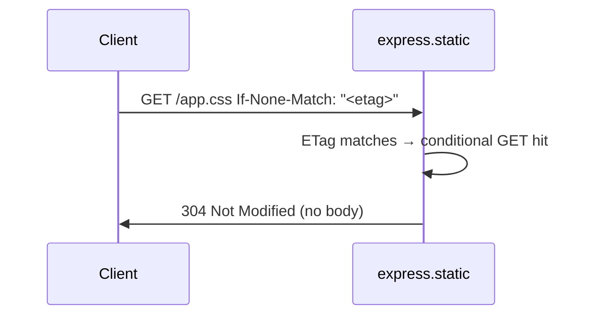
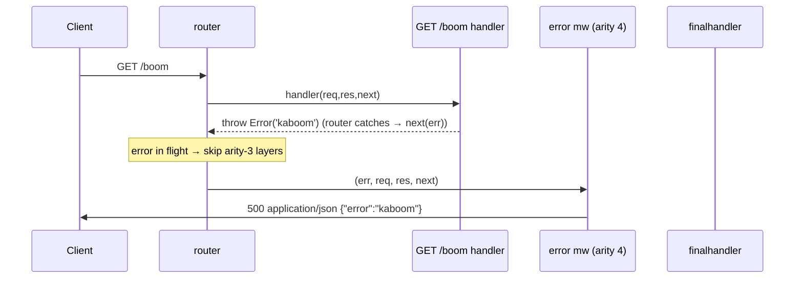

# 10 · Key Flows

> **What you'll be able to answer after this chapter**
> - For each important operation, the exact step-by-step path through the code with real values. (Control flow)
> - How the subsystems (app, router, req, res, view, middleware) compose at runtime. (Architecture)

Each flow below is an end-to-end trace with a sequence diagram and concrete data, citing the
same `file:line` anchors as the subsystem chapters. These are the "read this to understand how
it actually runs" walkthroughs.

---

## Flow 1 — App startup and `listen`

```js
const app = express();
app.get('/', (req, res) => res.send('Hello World'));
app.listen(3000, () => console.log('up'));
```

```mermaid
sequenceDiagram
    participant U as your code
    participant F as createApplication (express.js:36)
    participant I as app.init (application.js:59)
    participant H as http (node)
    U->>F: express()
    F->>F: app = fn(req,res,next){app.handle(...)}
    F->>F: mixin EventEmitter + application proto
    F->>F: app.request / app.response = Object.create(req/res, {app})
    F->>I: app.init()
    I->>I: cache/engines/settings = Object.create(null)
    I->>I: defaultConfiguration() — all defaults
    I->>I: define lazy `router` getter
    F-->>U: app
    U->>U: app.get('/', handler) → this.route('/').get(handler)  (first router access builds Router)
    U->>H: app.listen(3000, cb)
    H->>H: http.createServer(app).listen(3000)
    Note over H: cb wrapped with once(); server.once('error', cb)
    H-->>U: http.Server (up)
```

Concrete: `express()` returns the callable app (`lib/express.js:37-56`); `app.get('/', …)`
triggers the first `this.router` access, which builds `new Router({ caseSensitive:false,
strict:false })` from the (default-off) routing settings (`lib/application.js:69-82`);
`app.listen(3000, cb)` does `http.createServer(this).listen(3000)` with `cb` wrapped by `once`
so it fires exactly once on `listening` or `error` (`lib/application.js:598-606`).

## Flow 2 — A simple `GET /` (the hello-world lifecycle)

```mermaid
sequenceDiagram
    participant C as Client
    participant S as http.Server
    participant A as app.handle (application.js:152)
    participant R as router.handle
    participant HN as handler
    C->>S: GET / HTTP/1.1
    S->>A: app(req, res)
    A->>A: X-Powered-By: Express (:160-162)
    A->>A: req.res=res; res.req=req (:165-166)
    A->>A: setPrototypeOf(req,this.request)/(res,this.response) (:169-170)
    A->>A: res.locals = {} (:173-175)
    A->>R: this.router.handle(req,res,done) (:177)
    R->>HN: match GET / → handler(req,res,next)
    HN->>C: res.send('Hello World')
    Note over HN: text/html; charset=utf-8; Content-Length:11; ETag: W/"b-..."
```

Concrete response headers/body:
```
HTTP/1.1 200 OK
X-Powered-By: Express
Content-Type: text/html; charset=utf-8
Content-Length: 11
ETag: W/"b-<hash>"

Hello World
```
Every header is explained in [Chapter 6 §2](06-the-response-object.md#2-ressendbody). The
router never reaches `finalhandler` because the handler responded.

## Flow 3 — A JSON POST with body parsing

```js
app.use(express.json());
app.post('/users', (req, res) => {
  if (!req.body.name) return res.status(400).json({ error: 'name required' });
  res.status(201).json({ id: 1, name: req.body.name });
});
// POST /users  Content-Type: application/json  body: {"name":"tj"}
```

```mermaid
sequenceDiagram
    participant C as Client
    participant A as app.handle
    participant JP as express.json (body-parser)
    participant HN as POST /users handler
    C->>A: POST /users {"name":"tj"}
    A->>JP: middleware (registered first, runs first)
    JP->>JP: Content-Type matches application/json, body present
    JP->>JP: read under limit, verify charset, JSON.parse (strict)
    JP->>JP: req.body = { name: 'tj' } ; next()
    A->>HN: handler(req,res,next)
    HN->>HN: req.body.name truthy → res.status(201).json({id,name})
    HN->>C: 201 application/json; charset=utf-8  {"id":1,"name":"tj"}
```

Failure branches (all from [Chapter 8](08-bundled-middleware.md)): body `true` → **400** strict;
oversize → **413**; bad charset → **415**; malformed JSON → **400** `[entity.parse.failed]`;
missing `name` → the handler's own **400**. Note the parser runs first only because it's
registered (`app.use`) before the route — order is registration order
([Chapter 4 §2](04-routing-and-middleware.md#2-the-dispatch-pipeline)).

## Flow 4 — Static file with a conditional GET (304)

```js
app.use(express.static('public'));   // public/app.css exists, 5 KB
```

First request `GET /app.css`:
```mermaid
sequenceDiagram
    participant C as Client
    participant ST as express.static (serve-static→send)
    C->>ST: GET /app.css
    ST->>ST: resolve public/app.css within root (403 if traversal)
    ST->>C: 200; Content-Type: text/css; charset=utf-8;<br/>Last-Modified; ETag; Cache-Control: public, max-age=0
```

Second request with validators `GET /app.css` + `If-None-Match: <etag>`:


Range request `GET /app.css` + `Range: bytes=0-99` → **206** with `Content-Range: bytes
0-99/5120` and the first 100 bytes (`test/express.static.js:593-690`). A traversal attempt
`GET /..%2f..%2fsecret` → **403** (`:580-590`). The same conditional/range machinery backs
`res.sendFile` (they share the `send` package).

## Flow 5 — `res.redirect`

```js
app.get('/old', (req, res) => res.redirect('/new'));
// GET /old  Accept: text/html
```

```mermaid
sequenceDiagram
    participant C as Client
    participant RD as res.redirect (response.js:815)
    RD->>RD: status=302; address = location('/new').get('Location') = '/new' (encodeUrl)
    RD->>RD: res.format({text,html,default}) → Accept: text/html → html body + Vary: Accept
    RD->>RD: status(302); Content-Length = byteLength(body)
    RD->>C: 302; Location: /new; Vary: Accept; <html>… Redirecting to /new</html>
```

The body is content-negotiated (`res.format`), so an `Accept: application/json` client gets an
empty body instead of HTML, and every response carries `Vary: Accept`
([Chapter 6 §5](06-the-response-object.md#5-resredirectstatus-url)). The URL is double-escaped
(`encodeUrl` for `Location`, `escapeHtml` for the body) to prevent header/HTML injection.

## Flow 6 — `res.render` (view + engine)

```js
app.set('view engine', 'ejs');
app.set('views', __dirname + '/views');
app.get('/hello/:name', (req, res) => res.render('hello', { name: req.params.name }));
// GET /hello/tj
```

```mermaid
sequenceDiagram
    participant C as Client
    participant RES as res.render (response.js:897)
    participant APP as app.render (application.js:522)
    participant V as View (view.js)
    participant E as ejs.__express
    C->>RES: GET /hello/tj → res.render('hello',{name:'tj'})
    RES->>APP: opts._locals=res.locals; default cb=send/next; app.render('hello',opts,done)
    APP->>APP: merge locals (app.locals<res.locals<opts); view cache off (dev)
    APP->>V: new View('hello',{defaultEngine:'ejs',root:'.../views',engines})
    V->>V: ext='.ejs'; engine=require('ejs').__express; lookup .../views/hello.ejs
    APP->>V: view.render(mergedLocals, done)  (via tryRender)
    V->>E: ejs.__express(path, {name:'tj',...}, onRender)
    E-->>V: (null, '<h1>Hello tj</h1>')
    V-->>APP: process.nextTick → done(null, html)
    APP-->>RES: done(null, html) → res.send(html)
    RES->>C: 200 text/html; charset=utf-8  <h1>Hello tj</h1>
```

If `hello.ejs` is missing, `app.render` calls `done(Error('Failed to lookup view "hello" in
views directory ".../views"'))` → default callback `req.next(err)` → finalhandler → **500**
([Chapter 7](07-views-and-rendering.md)).

## Flow 7 — Error propagation (throw → error middleware → finalhandler)

```js
app.get('/boom', (req, res) => { throw new Error('kaboom'); });
app.use((err, req, res, next) => {          // arity-4 error handler, registered LAST
  res.status(err.status || 500).json({ error: err.message });
});
```



If **no** error handler were registered, the error would reach `finalhandler`, producing a
**500** and logging via `logerror` (silent under `NODE_ENV=test`,
`lib/application.js:615-618`). A handler that `next(err)`-re-raises does the same. Ordinary
(arity-3) middleware between the throw and the error handler is **skipped**
([Chapter 4 §2](04-routing-and-middleware.md#error-handling-middleware--arity-4)).

## Flow 8 — Mounted router with a param callback

```js
const users = express.Router({ mergeParams: false });
users.param('id', (req, res, next, id) => { req.userId = Number(id); next(); });
users.get('/:id', (req, res) => res.json({ id: req.userId }));
app.use('/users', users);
// GET /users/42
```

```mermaid
sequenceDiagram
    participant C as Client
    participant BR as base router
    participant SR as users router
    participant P as param('id')
    participant HN as GET /:id handler
    C->>BR: GET /users/42
    BR->>BR: match mount /users → strip req.url to /42, set req.baseUrl=/users
    BR->>SR: enter users router
    SR->>P: :id matches → param cb(req,res,next,'42')  (once per value)
    P->>P: req.userId = 42 ; next()
    SR->>HN: handler → res.json({id:42})
    HN->>C: 200 application/json {"id":42}
    Note over BR: on unwind, req.url/params restored for later parent layers
```

Param values arrive **decoded** and the callback fires **once per request per value**
([Chapter 4 §5](04-routing-and-middleware.md#5-appparamname-fn--parameter-preprocessing)). A
`GET /users` (no id) with only `/:id` → **404** because `:id` requires a segment.

## Flow 9 — Content negotiation with `res.format`

```js
app.get('/data', (req, res) => res.format({
  'text/html': () => res.send('<b>hi</b>'),
  'application/json': () => res.json({ msg: 'hi' }),
  default: () => res.status(406).send('Not Acceptable'),
}));
```

```mermaid
sequenceDiagram
    participant C as Client
    participant FMT as res.format (response.js:571)
    C->>FMT: GET /data  Accept: application/json
    FMT->>FMT: keys=[html,json]; key=req.accepts(keys)='application/json'
    FMT->>FMT: Vary: Accept; Content-Type: application/json
    FMT->>C: obj['application/json']() → res.json({msg:'hi'})
```

- `Accept: text/html` → the html branch. `Accept: text/plain` (no match) → the `default` branch
  (a 406). If there were **no** `default`, `res.format` would pass a `createError(406, …)` to
  `next` ([Chapter 6 §7](06-the-response-object.md#7-resformatobj--content-negotiation)).
- Every response carries `Vary: Accept`.

## Flow 10 — HEAD and automatic OPTIONS

```js
app.get('/thing', (req, res) => res.send('body'));
app.put('/thing', (req, res) => res.send('updated'));
```
- `HEAD /thing` → served by the GET route: 200, all the same headers as GET, **no body**
  (`res.send` detects HEAD, `lib/response.js:211-213`; `test/app.head.js`).
- `OPTIONS /thing` → auto-answered: `Allow: GET, HEAD, PUT` (HEAD auto-added because GET
  exists), body = the same list (`test/app.options.js:7-18`). No matching path → **404**;
  there is **no automatic 405** ([Chapter 4 §7](04-routing-and-middleware.md#7-automatic-head-options-and-the-absence-of-405)).

## Where to look

- `lib/application.js:152-178` — the decoration+dispatch entry every flow passes through.
- Subsystem chapters for the details each flow references: [3](03-the-application-object.md),
  [4](04-routing-and-middleware.md), [5](05-the-request-object.md), [6](06-the-response-object.md),
  [7](07-views-and-rendering.md), [8](08-bundled-middleware.md).

## Open questions

- Router-internal ordering/deferral (Flows 8, 10) is in the `router` package; behavior is
  pinned by the tests cited.

**Next:** [11 · Failure Modes & Edge Cases](11-failure-modes-and-edge-cases.md).
